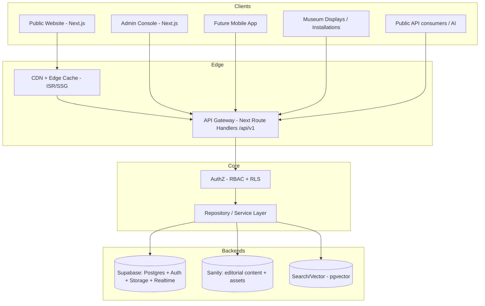

# 01 · Backend Architecture

Planet B is **headless and API-first**. The frontends are interchangeable clients; the backend is the institution. No page ever hardcodes content.

## System context (C4 level 1)



> ASCII fallback: Clients → Edge (CDN + API gateway) → AuthZ → Repository layer → {Supabase, Sanity, Search}. One repository layer, many clients.

## Layered architecture (request lifecycle)

```
Client
  │  HTTP (REST /api/v1, or typed server actions)
  ▼
API Gateway (Next.js Route Handlers)          ── validation (zod), versioning, rate limit
  ▼
Authorization (RBAC resolver + Supabase RLS)  ── never trust the client; deny by default
  ▼
Service layer (use-cases / domain logic)      ── orchestration, transactions, events
  ▼
Repository layer (interfaces + adapters)      ── SupabaseRepo | SanityRepo | (today) JsonRepo
  ▼
Data sources (Postgres, Sanity, Storage, Vector)
```

Two enforcement points, by design: **RLS in Postgres** (the last line of defence — even a leaked key can't exceed a role) **and** an application **RBAC resolver** (clean errors, UX gating). Defence in depth.

## Core principles
1. **Replaceable parts.** Every data source sits behind a repository *interface*. Swapping Sanity, or sharding Postgres, touches an adapter — never a page or a use-case.
2. **Content, not code.** Homepage, hero, mission, navigation, footer, timeline, stats — all fetched. The repo ships a typed default only as a seed/fallback, never as the source of truth.
3. **Server-first.** React Server Components fetch through the service layer; secrets (service-role key, Sanity token) live server-side only. The browser sees data, never credentials.
4. **Event-aware.** Mutations emit domain events (`artwork.published`, `certificate.issued`) for audit logs, cache invalidation, search re-indexing, and future webhooks — decoupled side effects.
5. **Stateless compute, stateful stores.** App servers hold no session state; horizontally scalable behind the edge. State lives in Postgres/Storage/Sanity.

## Where today's code fits
`lib/data.ts` is already the only data-aware module. It becomes `lib/repositories/*` with a `JsonRepository` (current seed) and a `SupabaseRepository` (next), chosen by config. Pages keep calling the same typed functions. This is the seam that makes the migration additive, not a rewrite.

## Boundaries (the contract between systems)
- **Sanity → Supabase:** editorial documents reference structured entities by **Registry ID** (a plain string field), never by embedding the entity. A blog post links `PB-ARTIST-000001`; it does not copy the artist.
- **Supabase → Sanity:** structured entities never store prose/marketing. An artwork has `statement` (the artist's words, archival fact); a *story about* the artwork lives in Sanity.
- **Resolution:** the service layer joins them — fetch the entity from Supabase, the narrative from Sanity, by shared Registry ID — and returns one composed view model to the client.
