# 02 · Database ERD

The structured core (Supabase/Postgres). Every entity carries: `id` (uuid PK), `registry_id` (permanent public ID), `slug`, soft-delete (`archived_at`), and audit columns. Relationships are explicit join tables — the [Relationship Engine](07-registry-and-relationships.md) is first-class.

```mermaid
erDiagram
  CHAPTERS ||--o{ ARTWORKS : has
  CHAPTERS ||--o{ TIMELINE_EVENTS : has
  CHAPTERS ||--o{ CERTIFICATES : issues
  CHAPTERS ||--o{ CHAPTER_PARTNERS : "partnered by"
  CHAPTERS ||--o{ FOUNDING_COUNCIL : records
  CHAPTERS ||--o{ IMPACT_METRICS : measures

  PEOPLE ||--o{ ARTWORKS : creates
  PEOPLE ||--o{ PERSON_CHAPTER_ROLES : holds
  PEOPLE ||--o{ CERTIFICATES : earns
  PEOPLE ||--o{ FOUNDING_COUNCIL : "member of"

  ORGANIZATIONS ||--o{ CHAPTER_PARTNERS : "is partner"
  ORGANIZATIONS ||--o{ PERSON_ORGANIZATIONS : employs
  ORGANIZATIONS ||--o{ CERTIFICATES : "may earn"

  ARTWORKS ||--o{ ARTWORK_MATERIALS : uses
  MATERIALS ||--o{ ARTWORK_MATERIALS : "used in"
  ARTWORKS ||--o{ ARTWORK_MEDIA : depicted_by
  MEDIA ||--o{ ARTWORK_MEDIA : depicts

  MEDIA ||--o{ MEDIA_RELATIONS : "related to"
  STORIES ||--o{ STORY_RELATIONS : connects

  ROLES ||--o{ ROLE_PERMISSIONS : grants
  PERMISSIONS ||--o{ ROLE_PERMISSIONS : "granted by"
  USERS ||--o{ USER_ROLES : assigned
  ROLES ||--o{ USER_ROLES : "assigned to"
  USERS ||--o{ AUDIT_LOGS : performs

  ENTITY_LINKS }o--o{ ENTITY_LINKS : "graph edges (any↔any)"
  REVISIONS }o--|| AUDIT_LOGS : "tracked by"
```



## Entity groups

**Cultural core** — `chapters`, `people`, `organizations`, `artworks`, `materials`, `timeline_events`, `performances`, `panels`, `press`, `founding_council`, `impact_metrics`. (Already modelled in [Phase 0 schema](../10-database-schema.md); Phase 2 adds `registry_id` + governance columns to each.)

**Media / DAM** — `media` (the asset registry, see [05](05-storage-strategy.md)) + `media_relations`.

**Knowledge graph** — `entity_links`: a single polymorphic edge table `(from_type, from_id, relation, to_type, to_id, weight, metadata)` that connects *any* object to *any* object, on top of the typed FK join tables. Typed joins give integrity; `entity_links` gives the open-ended graph the brief calls for ([07](07-registry-and-relationships.md)).

**Identity & access** — `users` (Supabase Auth), `roles`, `permissions`, `role_permissions`, `user_roles` (role assignment can be scoped to a `chapter_id`).

**Governance / preservation** — `revisions` (version history per row), `audit_logs` (who/what/when/before/after), `publication_states` (draft/in_review/published/archived), `analytics_events`.

## Cross-cutting columns (every cultural & media table)
```
id            uuid PK
registry_id   text unique   -- e.g. PB-ARTWORK-000001 (permanent, never changes)
slug          text unique   -- stable public URL
status        publication_state  -- draft | in_review | published | archived
consent_status consent_status    -- where people are involved
verified      boolean
created_at, updated_at, created_by, updated_by
archived_at   timestamptz   -- soft delete; NULL = live (nothing is ever hard-deleted)
search_vector tsvector      -- full-text
embedding     vector(1536)  -- reserved for semantic search (pgvector), nullable
```

## Why this shape scales to the targets
- **Keyset pagination** on `(created_at, id)` and registry sequences → no offset cliffs at 250k artworks.
- **Polymorphic `entity_links`** keeps the graph flexible without N² join tables as object types grow.
- **Partitioning candidates** flagged early: `audit_logs` and `analytics_events` by month; `media` by chapter/year if needed.
- **Read scaling** via Postgres read replicas + edge cache; writes stay on primary.
