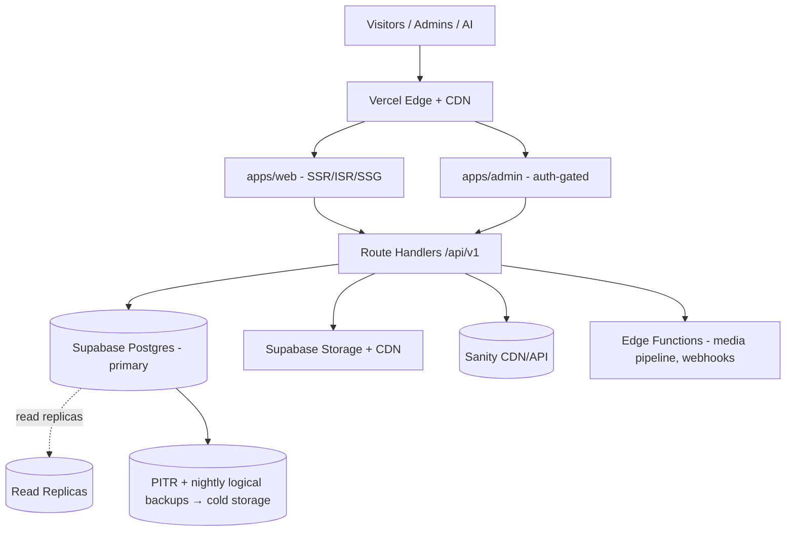

# 11 · Deployment Architecture & Scalability

Managed, boring, durable infrastructure — an institution avoids bespoke ops. **Vercel** (web + admin), **Supabase** (Postgres + Auth + Storage + Edge Functions), **Sanity** (managed editorial), a **CDN** for media. Designed for the scale targets without redesign.

## Topology


## Environments
| Env | Web/Admin | Database | Purpose |
|-----|-----------|----------|---------|
| `development` | local | local Supabase (Docker) / branch DB | day-to-day |
| `preview` | Vercel per-PR | Supabase **branch** per PR | review, e2e, demos |
| `staging` | Vercel | staging project | pre-prod rehearsal, migration dry-run |
| `production` | Vercel | production project (+ replicas) | live |

Config via validated env (`packages/config`, zod). Secrets in Vercel/Supabase secret stores — never in repo. Feature flags gate unfinished modules.

## CI/CD (GitHub Actions)
```
PR:    install → typecheck → lint → unit+integration tests → build →
       spin Supabase branch → run migrations → e2e (Playwright) → preview deploy
main:  all above → migrate staging → smoke → manual approve →
       migrate production (forward-only, reversible) → deploy → post-deploy checks
```
- **Database migrations are versioned, reviewed, and run in CI** (never by hand in prod). Each has an `up` and a tested `down`.
- **Zero-downtime**: expand→migrate→contract pattern for schema changes; deploys are atomic on Vercel.
- Releases tagged; changelog from Conventional Commits.

## Caching & performance (60fps / fast in Abuja on a phone)
- **SSG/ISR** for public pages (artist/artwork/chapter) — rebuilt on `*.published` webhook → revalidate tags. Reads are mostly static + edge-cached.
- **CDN** for all media derivatives; content-hashed URLs.
- **Keyset pagination** + indexed queries; **read replicas** absorb public read load; primary handles writes.
- Performance budgets enforced in CI (Lighthouse/LHCI): LCP, JS size, a11y.

## Scaling to the targets (100 countries → millions of media)
| Concern | Mechanism |
|---------|-----------|
| Read volume | ISR + CDN + Postgres read replicas |
| Write volume | primary autoscale (compute add-ons); async pipeline for media |
| Big tables (`audit_logs`, `analytics_events`, `media`) | monthly/range **partitioning**; archive cold partitions |
| Search at scale | Postgres FTS → dedicated search/pgvector or external (Typesense/Elastic) behind the search repo interface |
| Media growth | object storage scales horizontally; lifecycle tiering (hot/cold) for masters |
| Multi-region latency | Vercel edge + (later) regional read replicas / Supabase read-replica regions |
| Tenancy (chapters) | logical (chapter_id + RLS) — no per-chapter infra; one platform, many chapters |

Nothing above requires re-architecture to reach the stated numbers; it's capacity tuning of the same design.

## Observability
- App logs + traces (OpenTelemetry) → a managed APM; error tracking (Sentry).
- Uptime/synthetic checks on public site + verify API + admin login.
- DB metrics (slow queries, replica lag), Storage egress, API rate-limit dashboards.
- **Audit logs** are product data, not ops logs — queryable in-app ([03](03-supabase-schema.md)).
