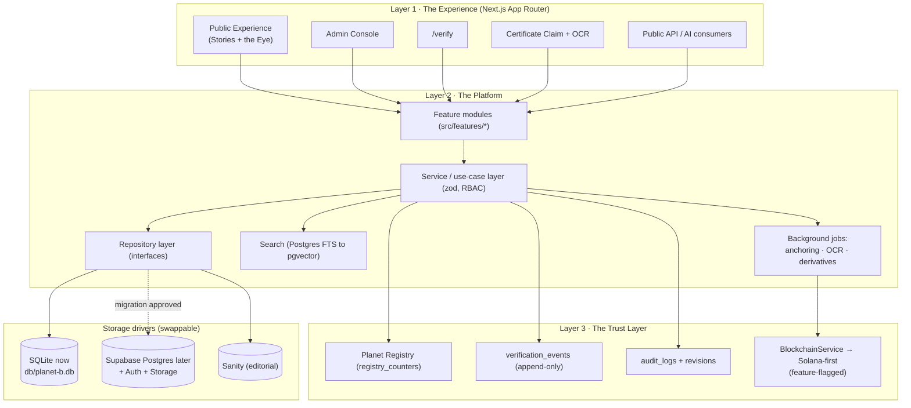

# 01 · System Architecture (Phase 2)

> **Status: DESIGN — awaiting approval.** Part of the [Phase 2 design package](00-README.md). No feature code ships from this document until the founder approves.

**Purpose.** This document gives Planet B a single, century-readable picture of how the *institution* runs as software: the three layers (Experience / Platform / Trust), how a request flows from a browser through Server Components and the Repository layer down to a swappable storage driver, where each subsystem physically lives, how it scales to 50,000 artists / 250,000 artworks / millions of assets, and where the blockchain is fenced off behind a feature flag. It is the map every other Phase 2 artifact hangs from.

**Extends.** [architecture/01 · Backend Architecture](../architecture/01-backend-architecture.md) and [architecture/11 · Deployment Architecture & Scalability](../architecture/11-deployment-architecture.md). Phase 1 established "headless, API-first, replaceable parts, server-first." Phase 2 *adds* the three-layer institutional framing, the formal Repository Pattern seam ([ADR-0004](adr/0004-repository-pattern.md)), the design-for-Postgres / run-on-SQLite backbone ([ADR-0001](adr/0001-data-backbone.md)), and the `BlockchainService` abstraction ([ADR-0007](adr/0007-blockchain-abstraction.md)). It does not restate Phase 1; where Phase 1 already decided something, this document references it.

---

## 1. The three layers

The institution is three concentric responsibilities. Each layer only knows the layer beneath it through a typed contract; nothing reaches across.

```
┌──────────────────────────────────────────────────────────────────────────────┐
│ LAYER 1 · THE EXPERIENCE                                                        │
│   Audiences: visitors · artists · researchers · sponsors · museums ·           │
│              embassies · students                                               │
│   Surfaces:  Public Experience (Stories as the primary lens; the Eye as         │
│              navigation + seal) · Admin Console · /verify · Certificate          │
│              Claim flow · Public API consumers / AI                             │
│   Tech:      Next.js App Router · React Server Components (default) ·            │
│              Server Actions · ISR/SSG + edge cache · WCAG AA                     │
└───────────────────────────────────┬────────────────────────────────────────────┘
                                     │  typed view-models only (never raw rows)
┌───────────────────────────────────▼────────────────────────────────────────────┐
│ LAYER 2 · THE PLATFORM                                                          │
│   Feature modules (src/features/*) · Service/use-case layer (zod at every        │
│   boundary, RBAC) · REPOSITORY LAYER (interfaces) ───────► driver               │
│   Search · Background jobs (anchoring · OCR · derivative generation)             │
│   Tech:      Next.js · Supabase (Postgres + Auth + Storage) · Sanity ·          │
│              search (Postgres FTS → pgvector / external) · Repository Pattern    │
└───────────────────────────────────┬────────────────────────────────────────────┘
                                     │  driver interface (swappable backbone)
┌───────────────────────────────────▼────────────────────────────────────────────┐
│ LAYER 3 · THE TRUST LAYER                                                        │
│   Planet Registry (registry IDs) · Certificates · Digital Identity (Passport) · │
│   Blockchain · Verification · Provenance · Audit Trail                          │
│   Tech:      registry_counters minting · verification_events (append-only) ·     │
│              audit_logs + revisions · BlockchainService → Solana-first           │
│              (feature-flagged) · RLS-ready authorization                         │
└──────────────────────────────────────────────────────────────────────────────┘

   Technology serves memory.  Technology serves trust.  Technology serves people.
```

| Layer | Name | Primary concern | Concrete tech in Phase 2 |
|------:|------|-----------------|--------------------------|
| 1 | **The Experience** | How people *meet* the archive — Stories first, the Eye as navigation + seal | Next.js App Router, RSC by default, Server Actions, ISR/SSG, edge cache, WCAG AA |
| 2 | **The Platform** | The machinery that serves and protects the records | Next.js · Supabase (Postgres + Auth + Storage) · Sanity · search · feature modules · **Repository Pattern** |
| 3 | **The Trust Layer** | Why the records can be *believed* — identity, provenance, proof | Planet Registry · Certificates · Passport · `verification_events` · `audit_logs`/`revisions` · `BlockchainService` (Solana-first, feature-flagged) |



---

## 2. Request / data flow — and why the backbone is swappable

The single most important architectural fact in Phase 2: **business logic never imports Drizzle/SQLite or the Supabase client directly.** It talks to a repository *interface*. That interface has a SQLite driver today and a Supabase Postgres driver later. Swapping the backbone is a driver change, not a rewrite ([ADR-0001](adr/0001-data-backbone.md), [ADR-0004](adr/0004-repository-pattern.md)).

```
Browser
  │  navigation / form submit
  ▼
Next.js App Router
  ├─ React Server Component  ── reads via service layer (no client secrets ever leave server)
  └─ Server Action           ── writes via service layer (zod-validated input)
  ▼
Feature module (src/features/<feature>)
  ▼
Service / use-case layer        ── orchestration · RBAC check · emits domain events
  ▼                                  · mints registry IDs · writes audit_logs + revisions
Repository INTERFACE            ── e.g. PassportRepository, StoryRepository, CertificateRepository
  ▼          (the swap seam)
Storage DRIVER
  ├─ SqliteDriver  (Drizzle → db/planet-b.db)         ◄── TODAY
  └─ SupabaseDriver (Postgres + Auth + Storage + RLS)  ◄── AFTER MIGRATION IS APPROVED
  ▼
Data source (SQLite file  →  Supabase Postgres / Storage  ·  Sanity for editorial prose)
```

**The seam in one sentence.** Phase 1 already isolated all data access in `lib/data.ts`; Phase 2 promotes that seam to a per-aggregate Repository Pattern so the *only* file that knows whether we are on SQLite or Postgres is the driver. Everything above the line — RSCs, Server Actions, services, features — is identical across backbones.

**Editorial vs. structured (unchanged from Phase 1).** Structured records (entities, certificates, passports) live in the relational backbone; long-form editorial prose lives in **Sanity** and references entities by **Registry ID** only. The service layer composes the two into one view-model. `stories` are the Phase 2 bridge object: a first-class narrative row in the backbone whose rich body block-JSON may be authored in/synced from Sanity, connected to everything else through `entity_links`.

---

## 3. Where each subsystem lives

| Subsystem | Surface (Layer 1) | Platform path (Layer 2) | Trust touchpoints (Layer 3) |
|-----------|-------------------|-------------------------|------------------------------|
| **Public Experience** | `/`, `/stories/*`, `/artists/*`, `/artworks/*`, `/chapters/*` (RSC, ISR/SSG) | `src/features/experience`, `…/stories` → read repos | reads `verified`, certificate + passport status badges |
| **Admin Console** | `/admin/*` (auth-gated) | `src/features/admin/*` → write repos via services | every write → `audit_logs` + `revisions`; status workflow |
| **/verify** | `/verify`, `/certificates/{publicId}` | `src/features/verification` | hashes `CertificateClaimV1`, reads `verification_events`, optional on-chain check |
| **Certificate claim / OCR** | claim upload UI + reviewer queue | `src/features/claims` → OCR job → reviewer | `claim_requests` lifecycle; `verification_events`; human approval ([ADR-0008](adr/0008-certificate-claiming.md)) |
| **Blockchain anchoring worker** | (none — background only) | `src/features/anchoring` job → `BlockchainService` | Merkle batch → `chain_anchors` + `onchain_refs`; feature-flagged ([ADR-0007](adr/0007-blockchain-abstraction.md)) |
| **Planet Passport** | `/passport/{PB-ID-…}` public identity page | `src/features/passport` (read-mostly projection) | `passports`, `passport_claims`, aggregated from graph + certificates |
| **Search** | site search, admin lookup | `src/features/search` behind a `SearchRepository` | — |

The Passport is a **projection/extension of `people`, not a user account** ([ADR-0002](adr/0002-passport-as-projection.md)). A living contributor *claims* their identity through `passport_claims`, which links a `users` account to a `people` row.

---

## 4. Environments, media, and background jobs

**Environments** (extends [architecture/11 §Environments](../architecture/11-deployment-architecture.md), reframed for the SQLite-now / Postgres-later backbone):

| Env | Web/Admin | Backbone | Notes |
|-----|-----------|----------|-------|
| `development` | local | **`db/planet-b.db` (SQLite file)** | the inheritable, century-readable working backbone today |
| `preview` | Vercel per-PR | SQLite seed (today) → Supabase branch (post-migration) | review, e2e, demos |
| `staging` | Vercel | staging Supabase project | migration dry-run, pre-prod rehearsal |
| `production` | Vercel | production Supabase project (+ read replicas) | live, once migration is approved |

The migration from the SQLite file to Supabase Postgres is a *driver swap plus a one-time data load* — see [02 · Database ERD §Migration note](02-database-erd.md) and [ADR-0001](adr/0001-data-backbone.md). Until that is approved, SQLite is the live backbone everywhere.

**CDN / media.** Media masters and derivatives are content-hashed and served from a CDN. Today derivatives live under `/public/media`; post-migration they move to **Supabase Storage + CDN** behind the same `MediaRepository` / `StorageDriver`. `media` rows already record `storagePath` (web/derivative) and `masterPath` (archive/source); Phase 2 `assets` columns add rights + derivative lineage (see [02](02-database-erd.md), [09](09-media-management-strategy.md)).

**Background jobs.** Three asynchronous pipelines, each driven by domain events and idempotent so they survive retries:

1. **Anchoring worker** — batches certificate/entity hashes into a Merkle root, calls `BlockchainService.anchor()`, writes `chain_anchors` + `onchain_refs`, logs a `verification_events` row. Runs only when the blockchain flag is on.
2. **OCR worker** — on a `claim_requests` upload, extracts text, parses fields, attempts a certificate match, advances status `uploaded → ocr_done → matched | needs_review`.
3. **Derivative generation** — on media upload, produces web derivatives (resized images, posters, captions), populating `assets`/`media` variants.

Today these run as in-process queued tasks against the SQLite backbone; post-migration they map to **Supabase Edge Functions / scheduled workers** with no change to the calling service code.

---

## 5. Scale posture — 50k artists · 250k artworks · millions of assets

This is capacity tuning of the *same* design, not a re-architecture (consistent with [architecture/11 §Scaling](../architecture/11-deployment-architecture.md)).

| Concern | Mechanism |
|---------|-----------|
| Public read volume | RSC + **ISR/SSG** + edge caching; pages rebuilt on `*.published` events via revalidate tags |
| Read fan-out at scale | **Postgres read replicas** absorb public reads (post-migration); primary handles writes |
| Large lists (250k artworks, millions of assets) | **keyset pagination** on `(created_at, id)`; indexed registry IDs; never offset pagination |
| Search | **Postgres FTS first**, escalating to **pgvector** or an external engine — all behind a `SearchRepository` so the engine swaps without touching features |
| Media growth (millions of assets) | object storage scales horizontally; content-hashed CDN URLs; hot/cold lifecycle tiering for masters |
| Append-only growth (`audit_logs`, `verification_events`) | range/monthly **partitioning** candidates flagged now; archive cold partitions |
| Multi-country / 500+ chapters | **logical tenancy** (`chapter_id` + RLS) — one platform, many chapters, no per-chapter infra; edge + regional replicas for latency |

The SQLite backbone is the *development and inheritance* substrate; the scale numbers are met by the Supabase Postgres driver. Because both sit behind the same repositories, the scaling work is configuration of the Postgres driver and infra, not application rewrites.

---

## 6. Caching / revalidation, observability, and the blockchain flag boundary

**Caching & revalidation.** Public pages are statically generated and edge-cached. Mutations emit domain events (`story.published`, `certificate.issued`, `passport.claimed`, `anchor.committed`); the service layer maps each to **revalidate tags** so only affected pages rebuild. Verification reads (`/verify`) are dynamic but cheap (hash compare + indexed lookup) and may be short-TTL cached.

**Observability.** App logs/traces (OpenTelemetry) → managed APM; error tracking (Sentry); uptime/synthetic checks on the public site, the **verify API**, and admin login; DB metrics (slow queries, replica lag) and Storage egress. Crucially, the Trust Layer's logs are **product data, not ops logs**: `audit_logs`, `revisions`, and `verification_events` are queryable in-app and feed `/verify` and the audit trail.

**The feature-flag boundary for blockchain.** All on-chain behavior sits behind a single boundary:

```
              feature flag: blockchain.enabled  (default OFF in Phase 2)
                                   │
  Service / job layer  ──► BlockchainService (interface) ──► driver
                                   │                          ├─ NullBlockchainService (no-op, default)
                                   │                          └─ SolanaBlockchainService (Solana-first)
                                   ▼
                       chain_anchors · onchain_refs · verification_events
```

- When the flag is **off**, certificates verify entirely **off-chain** (sha256 of `CertificateClaimV1`), exactly as Phase 1 designed; `onChain` is `false`. Nothing in the Experience or Platform layers depends on a chain being present.
- When the flag is **on**, the anchoring worker and mint paths activate; the same `BlockchainService` interface fronts a Solana-first driver, with custody optional ([ADR-0007](adr/0007-blockchain-abstraction.md), [06 · Solana Integration Plan](06-solana-integration-plan.md), [07 · Blockchain Abstraction Interface](07-blockchain-abstraction-interface.md)).

"Blockchain-ready, not now" (Principle VII) is therefore an architectural property, not a promise: the abstraction, tables, and worker are designed and stubbed; the chain is dark until the flag flips.

---

## Open questions for approval

1. **Repository granularity.** One repository per aggregate (Passport, Story, Certificate, Asset, Claim, Anchor) vs. a smaller set of broad repositories — which do we commit to for [ADR-0004](adr/0004-repository-pattern.md)?
2. **Job runtime today.** Are in-process queued jobs acceptable on the SQLite backbone for OCR/derivatives during Phase 2 dev, deferring Edge Functions until the Postgres migration?
3. **Stories ↔ Sanity boundary.** Is `stories.body` authored natively in the admin console (block JSON in the backbone) or authored in Sanity and synced? This decides whether Sanity is required in Phase 2 or remains "designed, adopted later."
4. **Search escalation trigger.** At what catalogue size do we move from Postgres FTS to pgvector/external — a fixed threshold, or driven by observed query latency?
5. **Default flag state.** Confirm `blockchain.enabled` ships **off** in every environment until [06](06-solana-integration-plan.md) is separately approved.
6. **ADR directory.** The canon references `adr/0001…0008` but `docs/phase-2/adr/` is not yet populated; should the ADR files be authored as part of this package before these documents are considered final?
