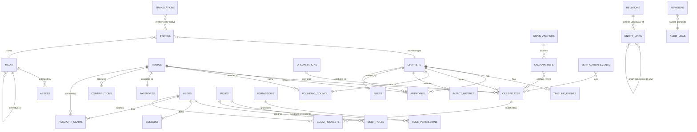

# 02 · Database ERD (Phase 2)

> **Status: DESIGN — awaiting approval.** Part of the [Phase 2 design package](00-README.md). No migration ships from this document until the founder approves.

**Purpose.** This document is the complete entity-relationship picture of Planet B after Phase 2: every **existing** table from [`db/schema.ts`](../../db/schema.ts) plus the **new** additive tables defined in the [canon](00-README.md) — `passports`, `passport_claims`, `stories`, `contributions`, `assets` (an *extension* of `media`), `claim_requests`, `chain_anchors`, `onchain_refs`, `verification_events`, `translations`, and `relations`. For each new table it specifies columns, keys, FKs, indexes, the SQLite-now / Postgres-later mapping, and RLS intent, while preserving the registry-ID, soft-delete, and audit conventions of the canon. It contains DDL **sketches** only — no application code.

**Extends.** [architecture/02 · Database ERD](../architecture/02-database-erd.md) and [architecture/03 · Supabase Schema](../architecture/03-supabase-schema.md), grounded in the real current schema [`db/schema.ts`](../../db/schema.ts) and types [`models/index.ts`](../../models/index.ts). Phase 1 modelled the cultural core, RBAC, and governance tables; Phase 2 *adds* the institutional tables without renaming anything that exists. Per [ADR-0001](adr/0001-data-backbone.md), every new table is authored Postgres-ready and mirrored in SQLite.

---

## 1. Conventions inherited from the canon (apply to every new cultural record)

New cultural/narrative records carry the `governance()` column set from `db/schema.ts` (the canon's "do not invent new enums" rule):

```
id            text PK (uuid)
registry_id   text unique         -- PB-<KIND>-<NNNNNN>, minted by registry_counters, permanent
slug          text unique
status        text default 'draft'-- draft | in_review | published | archived
verified      boolean default 0
created_at    text default now    -- ISO text in SQLite  → timestamptz in Postgres
updated_at    text default now
created_by    text
updated_by    text
archived_at   text                -- soft delete; NULL = live. NOTHING is hard-deleted.
```

**New registry kinds** (extend `registry_counters.kind`): `story`, `id` (Passport → `PB-ID-…`), `anchor` (`PB-ANCHOR-…`), and `asset` (alias of `media` where useful). Log every write to `audit_logs` and snapshot to `revisions`, exactly as today.

Operational/append-only tables (`passport_claims`, `claim_requests`, `chain_anchors`, `onchain_refs`, `verification_events`, `translations`, `relations`) do **not** all carry the full governance set; they carry their own keys + audit timestamps as noted per table.

---

## 2. Full ERD



> **ASCII fallback.** Existing core: `chapters · people · organizations · artworks · media · timeline_events · certificates · entity_links · impact_metrics · press · founding_council` + RBAC (`users · roles · permissions · role_permissions · user_roles · sessions`) + governance (`audit_logs · revisions · registry_counters`). Phase 2 adds: `passports` (1:1 people), `passport_claims` (users↔people), `stories`, `contributions` (n:1 people), `assets` (extends media), `claim_requests`, `chain_anchors`→`onchain_refs`, `verification_events`, `translations`, `relations`. `entity_links` overlays everything as a polymorphic graph; `relations` is its controlled vocabulary.

---

## 3. New tables — columns, keys, indexes, and Postgres notes

> SQLite/Postgres mapping rules used throughout (per [ADR-0001](adr/0001-data-backbone.md)):
> `text` ISO timestamps → `timestamptz` · `integer 0/1` booleans → `boolean` · `text {mode:json}` → `jsonb` · `integer autoincrement` → `bigint generated always as identity` · app-enforced enums stay `text` + `CHECK` (or Postgres `enum`). Every FK that exists in SQLite as a `references()` becomes a real Postgres FK. **RLS intent** is stated per table; RLS is *designed now, enabled on migration* (SQLite has no RLS — enforced in `lib/rbac` until then).

### 3.1 `passports` — identity projection/extension of `people` ([ADR-0002](adr/0002-passport-as-projection.md))

A Passport is **not** a user account. One row per `people` row that represents a real contributor. Aggregations (certificates, artworks, contributions) are **computed from the graph + joins, not duplicated here**.

| Column | SQLite type | Notes / Postgres |
|--------|-------------|------------------|
| `id` | text PK (uuid) | |
| `registry_id` | text unique | not minted via counters; equals the passport_id below for human use |
| `passport_id` | text unique notnull | `PB-ID-<NNNNNN>`, minted from `registry_counters.kind='id'` |
| `person_id` | text notnull, FK→`people.id`, **unique** | enforces 1:1 with people |
| `country` | text | |
| `passport_status` | text default `'unclaimed'` | `unclaimed | claimed | linked` (CHECK / enum) |
| `created_at` / `updated_at` | text default now | → timestamptz |
| `archived_at` | text | soft delete |

```sql
-- SQLite-now sketch (Drizzle-equivalent DDL)
CREATE TABLE passports (
  id            TEXT PRIMARY KEY,
  registry_id   TEXT UNIQUE,
  passport_id   TEXT UNIQUE NOT NULL,           -- PB-ID-000001
  person_id     TEXT NOT NULL UNIQUE REFERENCES people(id),
  country       TEXT,
  passport_status TEXT NOT NULL DEFAULT 'unclaimed',  -- unclaimed|claimed|linked
  created_at    TEXT NOT NULL DEFAULT (strftime('%Y-%m-%dT%H:%M:%fZ','now')),
  updated_at    TEXT NOT NULL DEFAULT (strftime('%Y-%m-%dT%H:%M:%fZ','now')),
  archived_at   TEXT
);
CREATE UNIQUE INDEX ux_passport_person ON passports(person_id);
CREATE INDEX ix_passport_status ON passports(passport_status);
```
**Postgres:** `person_id` real FK; `passport_status` → enum `passport_status`. **RLS:** public can read passports whose `person.consent_status='granted'` and `status='published'`; writes admin-only.

### 3.2 `passport_claims` — a living contributor claiming their identity

| Column | SQLite type | Notes / Postgres |
|--------|-------------|------------------|
| `id` | text PK (uuid) | |
| `user_id` | text notnull, FK→`users.id` | the account claiming |
| `person_id` | text notnull, FK→`people.id` | the identity claimed |
| `status` | text default `'pending'` | `pending | approved | rejected` |
| `evidence` | text {json} | links/notes supporting the claim → jsonb |
| `reviewer` | text, FK→`users.id` | who decided |
| `decided_at` | text | |
| `created_at` | text default now | |

```sql
CREATE TABLE passport_claims (
  id          TEXT PRIMARY KEY,
  user_id     TEXT NOT NULL REFERENCES users(id),
  person_id   TEXT NOT NULL REFERENCES people(id),
  status      TEXT NOT NULL DEFAULT 'pending',   -- pending|approved|rejected
  evidence    TEXT,                               -- json
  reviewer    TEXT REFERENCES users(id),
  decided_at  TEXT,
  created_at  TEXT NOT NULL DEFAULT (strftime('%Y-%m-%dT%H:%M:%fZ','now'))
);
CREATE INDEX ix_claim_user   ON passport_claims(user_id);
CREATE INDEX ix_claim_person ON passport_claims(person_id);
CREATE UNIQUE INDEX ux_claim_open ON passport_claims(user_id, person_id) WHERE status='pending';
```
**Postgres:** `evidence` → jsonb; partial unique index supported natively. **RLS:** a user reads/creates only their own claims; reviewers (role-gated) read/update all.

### 3.3 `stories` — first-class narrative ([ADR-0003](adr/0003-story-first-class.md))

Carries the full `governance()` set + narrative columns. Connected to everything via `entity_links` (`relation = 'features' | 'mentions' | 'belongs_to'`).

| Column | SQLite type | Notes / Postgres |
|--------|-------------|------------------|
| *(governance set)* | | id, registry_id (`PB-STORY-…`), slug, status, verified, created/updated/by, archived_at |
| `title` | text notnull | |
| `subtitle` | text | |
| `dek` | text | standfirst |
| `body` | text {json} | block JSON → jsonb |
| `cover_media` | text, FK→`media.id` | |
| `chapter_id` | text, FK→`chapters.id` | nullable |
| `kind` | text notnull | `feature | exhibition | profile | dispatch | essay` |

```sql
CREATE TABLE stories (
  id          TEXT PRIMARY KEY,
  registry_id TEXT UNIQUE,                        -- PB-STORY-000001
  slug        TEXT UNIQUE,
  status      TEXT NOT NULL DEFAULT 'draft',      -- draft|in_review|published|archived
  verified    INTEGER NOT NULL DEFAULT 0,
  title       TEXT NOT NULL,
  subtitle    TEXT,
  dek         TEXT,
  body        TEXT,                               -- block json
  cover_media TEXT REFERENCES media(id),
  chapter_id  TEXT REFERENCES chapters(id),
  kind        TEXT NOT NULL DEFAULT 'feature',    -- feature|exhibition|profile|dispatch|essay
  created_at  TEXT NOT NULL DEFAULT (strftime('%Y-%m-%dT%H:%M:%fZ','now')),
  updated_at  TEXT NOT NULL DEFAULT (strftime('%Y-%m-%dT%H:%M:%fZ','now')),
  created_by  TEXT, updated_by TEXT, archived_at TEXT
);
CREATE INDEX ix_story_status  ON stories(status);
CREATE INDEX ix_story_chapter ON stories(chapter_id);
CREATE INDEX ix_story_kind    ON stories(kind);
```
**Postgres:** `body` → jsonb; add `search_vector tsvector` + `embedding vector(1536)` (nullable) for FTS/semantic per [architecture/02]. **RLS:** public reads `status='published' AND archived_at IS NULL`; writes role-gated, audit-logged.

### 3.4 `contributions` — life-events that grow a Passport over time

| Column | SQLite type | Notes / Postgres |
|--------|-------------|------------------|
| `id` | text PK (uuid) | |
| `registry_id` | text unique | optional |
| `person_id` | text notnull, FK→`people.id` | |
| `kind` | text notnull | `exhibition | award | mentorship | interview | research | talk | residency | role_change` |
| `title` | text notnull | |
| `occurred_on` | text | ISO date → date/timestamptz |
| `chapter_id` | text, FK→`chapters.id` | nullable |
| `source` | text | provenance of the fact |
| `verified` | boolean default 0 | |
| `created_at`/`updated_at`/`archived_at` | text | |

```sql
CREATE TABLE contributions (
  id          TEXT PRIMARY KEY,
  registry_id TEXT UNIQUE,
  person_id   TEXT NOT NULL REFERENCES people(id),
  kind        TEXT NOT NULL,                      -- exhibition|award|mentorship|interview|research|talk|residency|role_change
  title       TEXT NOT NULL,
  occurred_on TEXT,
  chapter_id  TEXT REFERENCES chapters(id),
  source      TEXT,
  verified    INTEGER NOT NULL DEFAULT 0,
  created_at  TEXT NOT NULL DEFAULT (strftime('%Y-%m-%dT%H:%M:%fZ','now')),
  updated_at  TEXT NOT NULL DEFAULT (strftime('%Y-%m-%dT%H:%M:%fZ','now')),
  archived_at TEXT
);
CREATE INDEX ix_contrib_person ON contributions(person_id, occurred_on);
CREATE INDEX ix_contrib_kind   ON contributions(kind);
```
Certificates and artworks remain their own tables and are **joined into** the Passport view, not copied here. **RLS:** public reads verified, published-person contributions; writes admin-only.

### 3.5 `assets` — DAM extension over `media` (we extend `media`, we do not fork it)

Per the canon and [09 · Media Management Strategy](09-media-management-strategy.md), `assets` adds rights + derivative lineage to the existing rich `media` row. Modeled as a **1:1 extension keyed by `media_id`** (or, equivalently, added columns on `media`); the columns below are the additive fields.

| Added column | SQLite type | Notes / Postgres |
|--------------|-------------|------------------|
| `media_id` | text PK, FK→`media.id` | 1:1 with the media row it extends |
| `usage_rights` | text | license/usage terms |
| `rights_holder` | text | |
| `derivative_of` | text, FK→`media.id` | self-reference: derivative → master |
| `variant` | text | e.g. `web | thumb | poster | print | caption` |
| `created_at`/`updated_at` | text | |

```sql
-- Extension table (keeps media untouched while adding DAM fields)
CREATE TABLE assets (
  media_id      TEXT PRIMARY KEY REFERENCES media(id),
  usage_rights  TEXT,
  rights_holder TEXT,
  derivative_of TEXT REFERENCES media(id),
  variant       TEXT,
  created_at    TEXT NOT NULL DEFAULT (strftime('%Y-%m-%dT%H:%M:%fZ','now')),
  updated_at    TEXT NOT NULL DEFAULT (strftime('%Y-%m-%dT%H:%M:%fZ','now'))
);
CREATE INDEX ix_asset_derivative ON assets(derivative_of);
CREATE INDEX ix_asset_variant    ON assets(variant);
```
**Note on `media` columns reused:** the existing `media` already carries `storagePath`, `masterPath`, `sha256`, `bytes`, `mime`, `width`, `height`, `durationS`, `altText`, `caption`, `credit`, `source`, `license`, `author`, `copyright`, `tags`, `captureDate`, `location` — `assets` only adds the four DAM fields the canon names. **Postgres:** if preferred, fold these four columns directly onto `media` instead of a side table (decision below). **RLS:** read follows the parent media; rights fields visible to admins.

### 3.6 `claim_requests` — certificate verification/claim workflow ([ADR-0008](adr/0008-certificate-claiming.md), [05](05-certificate-verification-spec.md))

| Column | SQLite type | Notes / Postgres |
|--------|-------------|------------------|
| `id` | text PK (uuid) | |
| `file_ref` | text | uploaded file storage key |
| `ocr_text` | text | extracted text |
| `parsed_fields` | text {json} | → jsonb |
| `matched_certificate_id` | text, FK→`certificates.id` | nullable until matched |
| `confidence` | real | 0..1 match score |
| `status` | text default `'uploaded'` | `uploaded | ocr_done | matched | needs_review | claimed | rejected` |
| `submitted_by` | text, FK→`users.id` | |
| `reviewer` | text, FK→`users.id` | |
| `created_at`/`updated_at` | text | |

```sql
CREATE TABLE claim_requests (
  id            TEXT PRIMARY KEY,
  file_ref      TEXT,
  ocr_text      TEXT,
  parsed_fields TEXT,                             -- json
  matched_certificate_id TEXT REFERENCES certificates(id),
  confidence    REAL,
  status        TEXT NOT NULL DEFAULT 'uploaded', -- uploaded|ocr_done|matched|needs_review|claimed|rejected
  submitted_by  TEXT REFERENCES users(id),
  reviewer      TEXT REFERENCES users(id),
  created_at    TEXT NOT NULL DEFAULT (strftime('%Y-%m-%dT%H:%M:%fZ','now')),
  updated_at    TEXT NOT NULL DEFAULT (strftime('%Y-%m-%dT%H:%M:%fZ','now'))
);
CREATE INDEX ix_claimreq_status ON claim_requests(status);
CREATE INDEX ix_claimreq_cert   ON claim_requests(matched_certificate_id);
CREATE INDEX ix_claimreq_user   ON claim_requests(submitted_by);
```
**Postgres:** `parsed_fields` → jsonb; `confidence` → numeric/double precision. **RLS:** submitter reads own; reviewers read/advance all. Every status transition writes a `verification_events` row.

### 3.7 `chain_anchors` — Merkle batch anchoring ([06](06-solana-integration-plan.md))

| Column | SQLite type | Notes / Postgres |
|--------|-------------|------------------|
| `id` | text PK (uuid) | |
| `anchor_id` | text unique notnull | `PB-ANCHOR-<NNNNNN>` (kind `anchor`) |
| `merkle_root` | text notnull | hex |
| `member_count` | integer notnull | leaves in the batch |
| `provider` | text | e.g. `solana` |
| `tx_ref` | text | on-chain transaction reference |
| `status` | text default `'pending'` | `pending | committed | failed` |
| `anchored_at` | text | |
| `created_at` | text default now | |

```sql
CREATE TABLE chain_anchors (
  id           TEXT PRIMARY KEY,
  anchor_id    TEXT UNIQUE NOT NULL,              -- PB-ANCHOR-000001
  merkle_root  TEXT NOT NULL,
  member_count INTEGER NOT NULL,
  provider     TEXT,
  tx_ref       TEXT,
  status       TEXT NOT NULL DEFAULT 'pending',   -- pending|committed|failed
  anchored_at  TEXT,
  created_at   TEXT NOT NULL DEFAULT (strftime('%Y-%m-%dT%H:%M:%fZ','now'))
);
CREATE INDEX ix_anchor_status ON chain_anchors(status);
```
**RLS:** anchors are public-readable proofs; writes are worker/admin-only. Populated only when the blockchain feature flag is on ([01 §6](01-system-architecture.md)).

### 3.8 `onchain_refs` — generic on-chain pointer for any entity

Generalizes `certificates.soulbound_ref` to artworks/chapters/etc.

| Column | SQLite type | Notes / Postgres |
|--------|-------------|------------------|
| `id` | text PK (uuid) | |
| `entity_type` | text notnull | `certificate | artwork | chapter | passport | …` |
| `entity_id` | text notnull | the target row id |
| `provider` | text | `solana | …` |
| `token_ref` | text | mint/account/address |
| `kind` | text notnull | `sbt | anchor | attestation` |
| `anchor_id` | text, FK→`chain_anchors.anchor_id` | nullable; set when kind=`anchor` |
| `minted_at` | text | |
| `created_at` | text default now | |

```sql
CREATE TABLE onchain_refs (
  id          TEXT PRIMARY KEY,
  entity_type TEXT NOT NULL,
  entity_id   TEXT NOT NULL,
  provider    TEXT,
  token_ref   TEXT,
  kind        TEXT NOT NULL,                      -- sbt|anchor|attestation
  anchor_id   TEXT REFERENCES chain_anchors(anchor_id),
  minted_at   TEXT,
  created_at  TEXT NOT NULL DEFAULT (strftime('%Y-%m-%dT%H:%M:%fZ','now'))
);
CREATE INDEX ix_onchain_entity ON onchain_refs(entity_type, entity_id);
CREATE INDEX ix_onchain_anchor ON onchain_refs(anchor_id);
```
**RLS:** public-readable; worker/admin writes.

### 3.9 `verification_events` — append-only log of every verify/claim/anchor/mint

Feeds the audit trail and `/verify`. **Append-only:** no updates, no deletes.

| Column | SQLite type | Notes / Postgres |
|--------|-------------|------------------|
| `id` | integer PK autoincrement | → bigint identity |
| `event_type` | text notnull | `verify | claim | anchor | mint` |
| `entity_type` | text | |
| `entity_id` | text | |
| `actor` | text | user id or `system` |
| `result` | text {json} | outcome payload → jsonb |
| `created_at` | text default now | |

```sql
CREATE TABLE verification_events (
  id          INTEGER PRIMARY KEY AUTOINCREMENT,
  event_type  TEXT NOT NULL,                      -- verify|claim|anchor|mint
  entity_type TEXT,
  entity_id   TEXT,
  actor       TEXT,
  result      TEXT,                               -- json
  created_at  TEXT NOT NULL DEFAULT (strftime('%Y-%m-%dT%H:%M:%fZ','now'))
);
CREATE INDEX ix_vev_entity ON verification_events(entity_type, entity_id);
CREATE INDEX ix_vev_type   ON verification_events(event_type, created_at);
```
**Postgres:** partition by month at scale (alongside `audit_logs`). **RLS:** read role-gated; inserts system-only (never client-writable).

### 3.10 `translations` — i18n overlay ([ADR-0006](adr/0006-i18n-strategy.md))

English is the source; locales are overlays, addressed by `(entity_type, entity_id, locale, field)`.

| Column | SQLite type | Notes / Postgres |
|--------|-------------|------------------|
| `id` | integer PK autoincrement | → bigint identity |
| `entity_type` | text notnull | |
| `entity_id` | text notnull | |
| `locale` | text notnull | e.g. `yo`, `fr` |
| `field` | text notnull | which column is translated |
| `value` | text notnull | translated value |
| `status` | text default `'draft'` | `draft | in_review | published` |
| `created_at`/`updated_at` | text | |

```sql
CREATE TABLE translations (
  id          INTEGER PRIMARY KEY AUTOINCREMENT,
  entity_type TEXT NOT NULL,
  entity_id   TEXT NOT NULL,
  locale      TEXT NOT NULL,
  field       TEXT NOT NULL,
  value       TEXT NOT NULL,
  status      TEXT NOT NULL DEFAULT 'draft',
  created_at  TEXT NOT NULL DEFAULT (strftime('%Y-%m-%dT%H:%M:%fZ','now')),
  updated_at  TEXT NOT NULL DEFAULT (strftime('%Y-%m-%dT%H:%M:%fZ','now'))
);
CREATE UNIQUE INDEX ux_translation ON translations(entity_type, entity_id, locale, field);
```
**RLS:** public reads `status='published'`; writes role-gated (translator/editor).

### 3.11 `relations` — controlled vocabulary for `entity_links.relation` ([03](03-knowledge-graph.md))

A small reference table that *constrains and documents* the strings allowed in `entity_links.relation` (e.g. `features`, `mentions`, `belongs_to`, `created_by`, `exhibited_in`).

| Column | SQLite type | Notes / Postgres |
|--------|-------------|------------------|
| `relation` | text PK | the vocabulary key |
| `label` | text notnull | human label |
| `inverse` | text, FK→`relations.relation` | inverse edge, if any |
| `from_types` | text {json} | allowed source entity types → jsonb |
| `to_types` | text {json} | allowed target entity types → jsonb |
| `description` | text | |

```sql
CREATE TABLE relations (
  relation    TEXT PRIMARY KEY,                   -- 'features','mentions','belongs_to',...
  label       TEXT NOT NULL,
  inverse     TEXT REFERENCES relations(relation),
  from_types  TEXT,                               -- json array
  to_types    TEXT,                               -- json array
  description TEXT
);
```
**Postgres:** `entity_links.relation` gains a FK → `relations(relation)` to enforce the vocabulary (in SQLite it is validated in `lib/rbac`/service layer). **RLS:** public-readable reference data; writes admin-only.

---

## 4. The knowledge graph overlay (`entity_links`)

The typed FK columns above (e.g. `artworks.artist_id`, `stories.chapter_id`, `contributions.person_id`) give **referential integrity**. On top of them, the existing polymorphic `entity_links` table gives the **open-ended graph** the institution needs — *any* object connected to *any* object:

```
entity_links(from_type, from_id, relation, to_type, to_id, weight, metadata)
   uq_edge      UNIQUE(from_type, from_id, relation, to_type, to_id)
   ix_edge_from (from_type, from_id)
   ix_edge_to   (to_type, to_id)
```

Phase 2 connects new objects through the *same* edge table, with `relation` drawn from the new `relations` vocabulary:

```
STORY  --features-->    PERSON / ARTWORK / CHAPTER
STORY  --belongs_to-->  CHAPTER
STORY  --mentions-->    anything
PASSPORT (via person) --exhibited_in--> CHAPTER   (computed/aggregated, not duplicated)
```

So the Passport's "aggregation is computed from graph + certificates" (canon §New records): the Passport view walks `entity_links` + joins `certificates`, `artworks`, and `contributions` for one person — it stores no copies.

```
        typed FKs  ──────────────►  integrity (one true parent, cascade rules)
             │
   relational core (people, artworks, stories, certificates, …)
             │
        entity_links  ────────────►  open graph (any↔any, weighted, vocabulary = relations)
```

---

## 5. Migration note — SQLite now → Supabase Postgres later ([ADR-0001](adr/0001-data-backbone.md))

Each new table is added to the **SQLite backbone today** and maps **1:1** to a Supabase Postgres table on migration. No new table introduces a SQLite-only construct that lacks a Postgres equivalent.

| SQLite (now) | Supabase Postgres (later) |
|--------------|---------------------------|
| `text` ISO timestamp + `default (strftime(...))` | `timestamptz` + `default now()` |
| `integer` 0/1 boolean | `boolean` |
| `text {mode:json}` (`evidence`, `body`, `parsed_fields`, `result`, `metadata`, `from_types`, `to_types`) | `jsonb` |
| `integer primary key autoincrement` (`verification_events`, `translations`) | `bigint generated always as identity` |
| app-validated enums (`passport_status`, `claim_requests.status`, `stories.kind`, …) | Postgres `enum` or `text` + `CHECK` |
| `references()` (validated in service layer) | real FK constraints + indexes |
| RBAC enforced in `lib/rbac` (SQLite has no RLS) | **RLS policies enabled** per the per-table intent above + Supabase Auth |
| (none) | add `search_vector tsvector` + `embedding vector(1536)` on `stories` (and other public entities) for FTS/pgvector |

Migration procedure (driver swap + one-time load), consistent with [01 · System Architecture §4](01-system-architecture.md): (1) create the Postgres schema from these DDL sketches; (2) bulk-load rows from `db/planet-b.db`; (3) enable RLS + FTS/embedding columns; (4) flip the repository config from `SqliteDriver` to `SupabaseDriver`. Application code (features, services) is unchanged because it only ever touched repository interfaces.

---

## Open questions for approval

1. **`assets` shape.** Side-extension table keyed by `media_id` (shown here, keeps `media` untouched) **vs.** folding the four DAM columns (`usage_rights`, `rights_holder`, `derivative_of`, `variant`) directly onto `media`. The canon says "extend `media`, do not fork it" — both satisfy that; which is preferred?
2. **`passports.registry_id` vs `passport_id`.** Should `passports` carry *both* a generic `registry_id` and the `passport_id` (`PB-ID-…`), or is `passport_id` the only public identifier (with `registry_id` omitted)?
3. **`relations` enforcement timing.** Enforce the `entity_links.relation → relations` FK from day one in Postgres, or keep it service-layer-validated until the vocabulary stabilizes?
4. **Derivative lineage location.** Should `derivative_of` live on `assets` (per canon wording) or directly on `media` so all media share one lineage column?
5. **`onchain_refs.anchor_id` linkage.** Confirm linking `onchain_refs` to `chain_anchors` via the human `anchor_id` (shown) rather than the internal `id`, so the on-chain proof is self-describing.
6. **Enum strategy on Postgres.** Native `enum` types (strict, migration-heavy to extend) vs. `text + CHECK` (flexible) for the new status/kind columns — one consistent choice across Phase 2?
7. **ADR files.** As in [01](01-system-architecture.md), the referenced `adr/00xx-*.md` files do not yet exist in `docs/phase-2/adr/`; should they be authored before this ERD is ratified?
