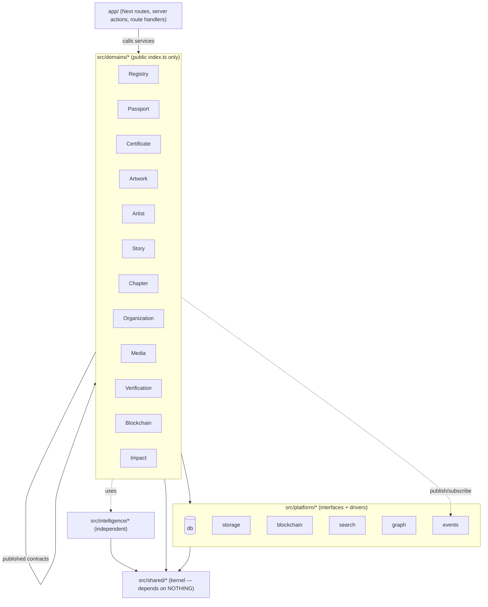
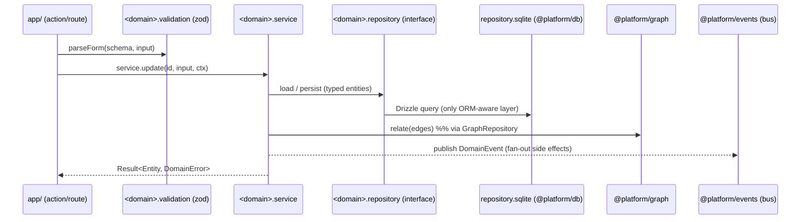

# 13 · Domain Architecture (Domain-Driven Design)

> **Purpose.** Define how Planet B's code is organized around the **language of the institution** — its business domains — rather than around the database or technical layers. This document is the canonical map of `src/domains/*`, `src/shared`, `src/platform`, and `src/intelligence`; it specifies what each of the 12 domains owns, the dependency rules that keep them decoupled, how the knowledge graph is owned, and the incremental migration that moves today's `lib/*` into domains **without breaking the running app**.

> **Extends** [docs/architecture/10-folder-architecture.md](../architecture/10-folder-architecture.md) (feature-based modules, repository pattern, strict TS, no duplicated logic). It carries those principles forward but **supersedes the feature-folder framing**: the top-level unit is now a *domain* (the institution's language), and the **repository becomes an implementation detail inside the domain** rather than a top-level concept. See [ADR-0009](adr/0009-domain-driven-architecture.md), which supersedes [ADR-0005](adr/0005-feature-architecture.md). Repositories remain mandatory and unchanged in spirit — [ADR-0004](adr/0004-repository-pattern.md) still holds — they simply live *inside* each domain.

This document obeys the canon in [00-README.md](00-README.md) (§ "Architectural evolution", § "Canonical vocabulary"). Where the two disagree, the README wins.

---

## 1. Why domain-driven (and not feature/DB-centric)

Phase 1 used the conventional Next.js layout (`app/` + `lib/` + `models/`). [ADR-0005](adr/0005-feature-architecture.md) proposed grouping by *feature* under `src/features/*`. Both are an improvement over a layer-first sprawl, but neither names the thing the institution actually cares about. Planet B is not a database with a UI; it is an **institution with a vocabulary** — Passports, Certificates, Stories, Chapters, the Registry, Verification, Provenance. That vocabulary is the most stable thing in the system; tables and frameworks are the least stable. So the architecture is organized around the vocabulary.

Consequences of this reframing:

- **The directory tree reads like the institution.** A newcomer who understands "a Certificate is issued for a contribution and can be Verified and anchored on a Blockchain" can find that code without knowing Drizzle, SQLite, or Next.js.
- **The database is an implementation detail.** A "Passport" is *not* the `passports` table — it is a projection over `people`, `certificates`, `contributions`, and the graph ([ADR-0002](adr/0002-passport-as-projection.md)). Organizing by table would scatter that concept; organizing by domain concentrates it.
- **Repositories still matter — they just move down a level.** [ADR-0004](adr/0004-repository-pattern.md) (no business logic imports Drizzle/SQLite/Supabase) is *strengthened*, not weakened: each domain owns a repository **interface** and a swappable **SQLite implementation**, so the Postgres/Supabase migration from [ADR-0001](adr/0001-data-backbone.md) stays a driver swap. The repository is no longer the headline of the structure; the domain is.
- **Boundaries become enforceable.** Domains publish a single `index.ts` contract; everything else is private. Cross-domain coupling is impossible to write by accident.

`Technology serves memory. Technology serves trust. Technology serves people.` The architecture should read like the institution it preserves.

---

## 2. The directory tree

New code lives under `src/` with these path aliases (the existing `@/*` → `./*` stays; the Next.js `app/` stays at the repo root and progressively delegates into domains):

| Alias | Resolves to | Holds |
|-------|-------------|-------|
| `@domains/*` | `src/domains/*` | the 12 business domains (the institution's language) |
| `@shared/*` | `src/shared/*` | the shared kernel (no domain dependencies) |
| `@platform/*` | `src/platform/*` | technical infrastructure behind interfaces |
| `@intelligence/*` | `src/intelligence/*` | the independent Intelligence Layer ([14](14-intelligence-layer.md), [ADR-0010](adr/0010-intelligence-layer.md)) |
| `@/*` | `./*` | **legacy / Next root** — `app/`, `db/`, `lib/`, `models/`, `components/` (shimmed during migration) |

```
planet-b/
├─ app/                         # Next.js routes & UI (stays at root). Routes call domain
│  ├─ (public)/                 # services via each domain's index.ts — never the DB, never a repo.
│  ├─ admin/(panel)/            # Server Components + server actions are thin adapters.
│  └─ api/                      # route handlers delegate to <domain>.api.ts
│
├─ db/                          # Drizzle client + schema (the single physical store today).
│  ├─ schema.ts                 # SQLite tables (unchanged shape; Postgres-ready).
│  └─ client.ts                 # `db` — imported ONLY by platform/db and repository impls.
│
├─ lib/                         # LEGACY. Emptied incrementally into domains; each file becomes
│  ├─ registry.ts               # a thin BACK-COMPAT RE-EXPORT SHIM pointing at the new home,
│  ├─ auth.ts                   # so app/ keeps working untouched while we migrate one domain
│  ├─ audit.ts                  # at a time. New code never imports lib/* directly.
│  ├─ data.ts  validation.ts  admin.ts  env.ts  rate-limit.ts  slug.ts
│
├─ models/                      # LEGACY view-model types; entities migrate into each domain's
│                               # entities/ and models/ re-exports from there during transition.
│
├─ src/
│  ├─ shared/                   # === SHARED KERNEL (depends on NOTHING) ===
│  │  ├─ result.ts              #   Result<T,E> / Either; ok()/err() helpers
│  │  ├─ errors.ts              #   DomainError hierarchy (NotFound, Forbidden, Conflict, Validation…)
│  │  ├─ ids.ts                 #   Id, RegistryId, PassportId value types + format guards
│  │  ├─ pagination.ts          #   Page<T>, PageQuery, cursor helpers
│  │  ├─ repository.ts          #   base Repository<T> interface (byId/list/create/update/archive/restore/revisions)
│  │  ├─ clock.ts               #   Clock interface (now()) — no `new Date()` in domains
│  │  ├─ audit.ts               #   audit/preservation primitives (AuditEntry, Revision value types)
│  │  ├─ graph.ts               #   GraphRelation / RelationName vocabulary (knowledge-graph kernel; §6)
│  │  ├─ events.ts              #   DomainEvent type + EventBus interface (lightweight; §5)
│  │  └─ index.ts               #   the kernel's public surface
│  │
│  ├─ platform/                 # === TECHNICAL INFRASTRUCTURE (depends only on @shared) ===
│  │  ├─ db/                    #   Drizzle client wrapper + unit-of-work; ONLY place that imports db/client
│  │  ├─ storage/               #   StorageService interface + local/Supabase drivers ([09])
│  │  ├─ blockchain/            #   BlockchainService interface + null/Solana drivers ([07], ADR-0007)
│  │  ├─ search/                #   SearchService interface (SQLite LIKE now → Postgres FTS later)
│  │  ├─ graph/                 #   GraphRepository (entity_links read/write; the physical graph store; §6)
│  │  ├─ events/               #   in-process EventBus implementation of @shared/events
│  │  └─ index.ts
│  │
│  ├─ intelligence/             # === INTELLIGENCE LAYER (independent; designed, not shipped) ===
│  │  ├─ intelligence.service.ts#   IntelligenceService interface (embeddings/OCR/translate/recommend)
│  │  ├─ null.intelligence.ts   #   no-op implementation used today (nothing AI ships yet)
│  │  └─ index.ts               #   sits BESIDE domains; depends only on @shared (never on a domain's internals)
│  │
│  └─ domains/                  # === THE 12 BUSINESS DOMAINS (the institution's language) ===
│     ├─ registry/              # reference domain — migrated first
│     │  ├─ entities/           #   domain types/aggregates (RegistryRecord, RegistryKind)
│     │  ├─ registry.service.ts #   business rules / use-cases (mint, resolve, reserve)
│     │  ├─ registry.repository.ts        # INTERFACE
│     │  ├─ registry.repository.sqlite.ts # IMPLEMENTATION (an implementation detail)
│     │  ├─ registry.validation.ts        # zod schemas
│     │  ├─ registry.api.ts     #   server-action / route-handler adapters
│     │  ├─ ui/                 #   components (where appropriate)
│     │  └─ index.ts            #   *** the domain's PUBLIC CONTRACT — the only import surface ***
│     ├─ passport/      …same internal layout…
│     ├─ certificate/   …
│     ├─ artwork/       …
│     ├─ artist/        …
│     ├─ story/         …
│     ├─ chapter/       …
│     ├─ organization/  …
│     ├─ media/         …
│     ├─ verification/  …
│     ├─ blockchain/    …       (the domain; wraps platform/blockchain BlockchainService)
│     └─ impact/        …
│
├─ components/                  # LEGACY shared UI; domain-specific UI migrates into <domain>/ui/.
└─ tsconfig.json                # path aliases above
```

### Standard internal layout (every domain is identical)

```
src/domains/<domain>/
├─ entities/                       # domain types & aggregates (no ORM, no React, no Next)
├─ <domain>.service.ts             # business rules / use-cases — the heart of the domain
├─ <domain>.repository.ts          # storage INTERFACE (extends @shared/repository)
├─ <domain>.repository.sqlite.ts   # Drizzle/SQLite IMPLEMENTATION (the ONLY ORM-aware file)
├─ <domain>.validation.ts          # zod schemas (input boundary)
├─ <domain>.api.ts                 # server-action / route-handler adapters (HTTP/Form ↔ service)
├─ ui/                             # domain components (where appropriate)
└─ index.ts                        # PUBLIC CONTRACT: re-exports service facade, entity types,
                                   # validation, api adapters. Nothing else is importable.
```

The repository implementation is the only file allowed to import `db/client` (via `@platform/db`). The service depends on the **interface** and is injected its concrete repo at a tiny composition root, so it is unit-testable with an in-memory fake — preserving [ADR-0004](adr/0004-repository-pattern.md).

---

## 3. The 12 domains

Domains are named in the institution's language ([00-README.md](00-README.md) § canon), **not** the database. One physical table can serve several domains (e.g. `people` underlies both Artist and Passport); one domain can span several tables (e.g. Verification spans `verification_events`, `claim_requests`, `onchain_refs`).

| Domain | Responsibility (one line) | Key entities it owns | Services / business rules | Publishes via `index.ts` | Depends on |
|--------|---------------------------|----------------------|---------------------------|--------------------------|------------|
| **Registry** | Mint & resolve permanent `PB-<KIND>-<NNNNNN>` identifiers; the spine every record hangs on. | `RegistryRecord`, `RegistryKind`, `RegistryId` | `mint(kind)` (atomic, never repeats — wraps today's `lib/registry.ts`), `resolve(registryId)`, `reserve(kind)` (Principle VI reserved slots) | `RegistryService`, id types, validation | `@platform/db`, `@shared` (RegistryId, Result, errors) |
| **Passport** | The lifelong contributor identity `PB-ID-…` as a **projection**, not a table or account ([04](04-planet-passport-spec.md), [ADR-0002](adr/0002-passport-as-projection.md)). | `Passport`, `PassportStatus` (`unclaimed\|claimed\|linked`), `Contribution` | `getPassport(personId)` (aggregates person + certificates + contributions + graph), `addContribution`, claim lifecycle (`passport_claims`) | `PassportService`, `Passport` view | `@domains/artist`, `@domains/certificate` (read via contract), `@platform/db`, `@platform/graph`, `@shared` |
| **Certificate** | Issue, revoke (never delete), and expose certificates of **contribution** ([05](05-certificate-verification-spec.md), [14](../14-certificate-system.md)). | `Certificate`, `CertificateStatus` (`draft\|issued\|revoked\|reserved`), `CertificateClaimV1` | `issue`, `revoke` (status, not delete), `byPublicId`, canonical-hash for off-chain verification | `CertificateService`, `Certificate`, `CertificateClaimV1` | `@domains/registry`, `@platform/db`, `@platform/blockchain` (anchor ref), `@shared` |
| **Artwork** | The artworks of each Chapter — title, statement, materials, media ([02](02-database-erd.md)). | `Artwork`, `ExhibitorRole` | `list/byId/create/update/archive/restore` (full governance), media binding, artist binding | `ArtworkService`, `Artwork` | `@domains/registry`, `@domains/media` (contract), `@platform/db`, `@platform/graph`, `@shared` |
| **Artist** | People in the `artist` role and their profiles — canonical node `person`, role `artist` (canon #7). | `Artist`/`Person`, `ConsentStatus`, `FoundingCouncilMember` | profile CRUD, **consent gating** (`granted\|pending\|withheld`, Principle IV) before any publication, role evolution | `ArtistService`, `Person` view | `@domains/registry`, `@platform/db`, `@platform/graph`, `@shared` |
| **Story** | First-class narrative that connects everything ([03 ADR](adr/0003-story-first-class.md), canon). | `Story`, `StoryKind` (`feature\|exhibition\|profile\|dispatch\|essay`) | author/publish workflow, block-JSON body, graph wiring (`features\|mentions\|belongs_to`) | `StoryService`, `Story` | `@domains/registry`, `@platform/db`, `@platform/graph`, `@shared` |
| **Chapter** | A movement chapter (city/country/event); Genesis is sacred & immutable (Principle II). | `Chapter`, `ChapterStatus`, `TimelineEvent`, `YorubaProverb` | chapter CRUD, **Genesis immutability guard**, timeline ordering | `ChapterService`, `Chapter`, `TimelineEvent` | `@domains/registry`, `@platform/db`, `@platform/graph`, `@shared` |
| **Organization** | Partners, sponsors, hosts, embassies, galleries ([02](02-database-erd.md)). | `Organization`, `OrganizationType`, `PartnerRole` | org CRUD, chapter-partner relations | `OrganizationService`, `Organization` | `@domains/registry`, `@platform/db`, `@platform/graph`, `@shared` |
| **Media** | Digital Asset Management lens over `media` (extended with rights/derivative fields) ([09](09-media-management-strategy.md)). | `Media`, `MediaKind` (`image\|video\|audio\|document` — schema canon, #2), rights/derivative metadata | upload→derive pipeline (via StorageService), checksum/preservation, rights tracking | `MediaService`, `Media` | `@platform/storage`, `@platform/db`, `@shared` |
| **Verification** | The verify/claim workflow + append-only proof log ([05](05-certificate-verification-spec.md), [ADR-0008](adr/0008-certificate-claiming.md)). | `ClaimRequest`, `VerificationEvent`, `VerificationResult`, `OnchainRef` | OCR→match→review→claim pipeline, hash check, **append-only** `verification_events`, feeds `/verify` | `VerificationService`, `VerificationResult` | `@domains/certificate` (contract), `@platform/blockchain`, `@intelligence` (OCR, later), `@platform/db`, `@shared` |
| **Blockchain** | The institution's anchoring/minting capability — designed now, custody-optional, Solana-first ([06](06-solana-integration-plan.md), [07](07-blockchain-abstraction-interface.md), [ADR-0007](adr/0007-blockchain-abstraction.md)). | `ChainAnchor` (`PB-ANCHOR-…`), `OnchainRef`, `MerkleBatch` | Merkle batching, `anchor()`, `mint()` — all behind `BlockchainService`; **nothing on-chain ships yet** | `BlockchainDomainService`, `ChainAnchor` | `@platform/blockchain` (the service interface), `@domains/registry`, `@platform/db`, `@shared` |
| **Impact** | Verified movement metrics per chapter (artists, artworks, waste diverted, press) ([02](02-database-erd.md)). | `ImpactMetric` | record/aggregate verified metrics, expose for dashboards | `ImpactService`, `ImpactMetric` | `@platform/db`, `@platform/graph`, `@shared` |

**Notes on shared physical stores.** Artist and Passport both read `people`; the `people` table is owned (written) by **Artist**, and **Passport** reads it through `ArtistService` (the published contract) plus its own projection logic — Passport never queries `people` directly. Likewise, `onchain_refs` is the source of truth owned by **Blockchain**; **Verification** and **Certificate** read it via the Blockchain contract (canon #8).

---

## 4. Dependency rules (the heart of DDD here)

These rules are the architecture. They are enforced by lint (import-boundary rules) and by code review, not left aspirational.

1. **A domain may import only another domain's `index.ts`** — never its `entities/`, `*.service.ts`, `*.repository*`, or `ui/`. The public contract is the only coupling point. (Cross-domain `*/internal` imports are a lint error.)
2. **The shared kernel depends on nothing.** `@shared/*` may import only other `@shared/*`. No domain, no platform, no Next, no ORM. It is pure types + tiny pure helpers (Result, errors, ids, pagination, Clock, base Repository, graph vocabulary, DomainEvent).
3. **Platform depends only on `@shared`.** `@platform/*` implements technical capabilities (db, storage, blockchain, search, graph, events) behind interfaces; it never imports a domain.
4. **Domains depend on `@shared` and `@platform` interfaces, plus other domains' `index.ts`.** A domain never imports `db/client` directly — only its own `*.repository.sqlite.ts` reaches the ORM, and only through `@platform/db`.
5. **The Intelligence Layer is independent.** `@intelligence/*` sits *beside* domains, depends only on `@shared`, and is consumed by domains via its interface ([ADR-0010](adr/0010-intelligence-layer.md)). It never imports a domain's internals. Nothing AI is wired into request paths yet.
6. **`app/` is the composition root + adapters only.** Routes and server actions import domain `index.ts` and call services; they hold no business logic, never touch a repository, and never import `db/client`.
7. **Cross-domain coordination prefers contracts; side-effecting fan-out uses domain events.** When issuing a Certificate must also append a `verification_event` and (later) request an anchor, the Certificate service publishes a `CertificateIssued` **domain event** rather than reaching into Verification/Blockchain. This keeps write-time coupling out of the call graph.

### The lightweight domain-event concept

A deliberately small contract in the shared kernel (`@shared/events`), with an in-process bus in `@platform/events`. No external broker; designed so a queue can be slotted under the interface later.

```ts
// @shared/events
export interface DomainEvent<T = unknown> {
  name: string;              // e.g. "certificate.issued"
  occurredAt: string;        // ISO, from Clock
  actor?: string | null;     // who caused it (for audit)
  payload: T;                // small, serializable
}
export interface EventBus {
  publish(event: DomainEvent): Promise<void>;
  subscribe(name: string, handler: (e: DomainEvent) => Promise<void>): void;
}
```

Events are for **notification and fan-out of side effects** (audit entries, graph edges, anchor requests, cache invalidation). They are **not** a substitute for a synchronous read across a published contract — when domain A needs domain B's data *now*, it calls `B.index.ts`.

### Dependency diagram



Arrows only ever point **toward stability**: app → domains → platform/shared; everything → shared. Nothing points back up. There are no domain → domain-internals edges.

---

## 5. How the knowledge graph is owned (ADR-0011)

The knowledge graph is a **core architectural principle**, not a feature ([00-README.md](00-README.md), [03](03-knowledge-graph.md), [ADR-0011](adr/0011-knowledge-graph-core.md)). "Every record is discoverable through relationships; nothing exists in isolation." That means the graph cannot belong to any one domain — every domain must be able to declare relations.

So the graph is a **capability in the shared/platform layer that every domain uses**:

- **`@shared/graph`** owns the *vocabulary*: the `RelationName` controlled list (`features | mentions | belongs_to | issued_for | created | partner_of | …`, mirroring the `relations` table) and the `GraphRelation` value type. Pure, dependency-free, so every domain can speak it.
- **`@platform/graph`** owns the *physical store*: a `GraphRepository` over the `entity_links` table (the polymorphic `from_type/from_id/relation/to_type/to_id` edges, with `weight`, `metadata`, and the additive soft-delete `archived_at` from reconciliation #3). It is the only code that reads/writes `entity_links`.
- **Every domain declares its relations through `GraphRepository`**, never by writing `entity_links` itself. When Story publishes, `StoryService` calls `graph.relate({ from: story, relation: "features", to: artwork })`. When a Certificate is issued, the `CertificateIssued` event handler records `issued_for`.

This keeps the graph **woven into every domain** (the ADR-0011 requirement) while keeping a single home for edge integrity, soft-delete, and the controlled vocabulary — no duplicated edge-writing logic, and a clean seam for the future Postgres/`pgvector`-backed graph.

---

## 6. The incremental migration plan

The Phase 1 app works today and must keep working. Migration is **one domain at a time**, additive, with **back-compat re-export shims** so `app/` never breaks. No big-bang rewrite ([ADR-0001](adr/0001-data-backbone.md) discipline, [15](15-implementation-roadmap.md) foundation-outward).

**Mechanism — the back-compat shim.** When `lib/X.ts` moves into a domain, the old path is replaced by a one-line re-export pointing at the new public contract:

```ts
// lib/registry.ts  (AFTER migration — back-compat shim; new code must NOT import this)
export { mintRegistryId } from "@domains/registry";
```

`app/` imports keep resolving; the implementation now lives in (and is tested in) the domain. Shims are deleted only once every caller has been moved to `@domains/*`.

**Order (foundation-outward; Registry is the reference domain, done first):**

| Step | Move | From → To | Shim left at |
|------|------|-----------|--------------|
| 0 | Scaffold | create `src/shared`, `src/platform`, `src/intelligence`; add `@domains/@shared/@platform/@intelligence` aliases to `tsconfig.json` | — |
| 1 | **Registry (reference)** | `lib/registry.ts` → `@domains/registry` (service + sqlite repo over `registry_counters`) | `lib/registry.ts` re-exports `mintRegistryId` |
| 2 | Audit/preservation | `lib/audit.ts` → `@shared/audit` types + `@platform/db` writer (`audit_logs`, `revisions`) | `lib/audit.ts` re-exports `writeAudit`, `writeRevision`, `recentAudit` |
| 3 | Graph kernel | introduce `@shared/graph` + `@platform/graph` over `entity_links`; route existing edge reads (`lib/data.ts` partners) through it | reads keep working |
| 4 | Identity/access | `lib/auth.ts` → `@platform/db` + an `auth`/access capability; keep `getCurrentUser/can/requireUser/requirePermission` signatures | `lib/auth.ts` re-exports the same functions |
| 5 | Validation | `lib/validation.ts` zod → each domain's `<domain>.validation.ts`; `parseForm` to `@shared` | `lib/validation.ts` re-exports schemas + `parseForm` |
| 6 | Read/write per cultural domain | `lib/data.ts` + `lib/admin.ts` → `Artist`, `Artwork`, `Organization`, `Chapter`, `Media` repositories & services | `lib/data.ts`, `lib/admin.ts` re-export named getters |
| 7 | New Phase 2 domains | `Passport`, `Certificate`, `Story`, `Verification`, `Blockchain`, `Impact` are **born in `src/domains/*`** (no legacy to shim) | n/a |
| 8 | Cutover | once a domain has zero `lib/*` callers, delete its shim and the dead `lib` file | shim removed |

Each step is a self-contained PR: move code, add the shim, point new callers at `@domains/*`, run the suite. Nothing else changes in the same PR.

---

## 7. Testing & boundaries

- **Unit (per domain):** the service is tested against an **in-memory fake repository** that implements `<domain>.repository.ts` — no database, no Next. This is the payoff of the repository-as-implementation-detail seam ([ADR-0004](adr/0004-repository-pattern.md)). A fixed `Clock` makes time deterministic.
- **Integration (per domain):** the `*.repository.sqlite.ts` is tested against a throwaway SQLite file to prove the Drizzle mapping (registry minting, soft-delete, audit/revision writes, graph edges).
- **Boundary tests (architecture):** an import-linter rule asserts the dependency rules of §4 — no `@domains/*/!(index)` cross-imports, no `db/client` import outside `@platform/db` and `*.repository.sqlite.ts`, no domain import inside `@shared`/`@platform`/`@intelligence`. A violation fails CI.
- **E2E:** drive `app/` routes; they exercise the full domain stack through the same contracts the UI uses.

### How a server action / route handler calls a domain

A route handler or server action is a **thin adapter**: parse input with the domain's zod schema, call the domain **service** (never a repository, never the DB), map the `Result`/`DomainError` to an HTTP/RFC-7807 response or a form error. It never imports `db/client`, never imports another domain's internals.

```ts
// app/admin/(panel)/artworks/actions.ts  (target shape after migration)
"use server";
import { ArtworkService, artworkSchema, parseForm } from "@domains/artwork";
import { requirePermission } from "@/lib/auth"; // shim → @platform access during migration

export async function updateArtwork(form: FormData) {
  const user = await requirePermission("artwork.update");
  const input = parseForm(artworkSchema, Object.fromEntries(form));
  const result = await ArtworkService.update(input.id, input, { actor: user.id });
  if (!result.ok) throw new Error(result.error.message); // typed DomainError → friendly message
  // ArtworkService internally: writes via repo, snapshots a revision, audits, and
  // relates graph edges / publishes domain events — the action stays thin.
}
```



---

## 8. Open questions for approval

1. **Alias surface.** Confirm the four aliases (`@domains`, `@shared`, `@platform`, `@intelligence`) plus retaining `@/*` — vs. a single `@src/*`. Recommendation: the four, for readability and lint targeting.
2. **`app/` vs `src/app/`.** The brief keeps `app/` at the repo root (routing/UI). Confirm we do **not** move routes under `src/` (Next.js supports both); recommendation: keep at root to minimize churn.
3. **Artist vs Passport ownership of `people`.** Confirm Artist *writes* `people` and Passport *reads via the Artist contract* (no direct `people` access from Passport) — vs. a dedicated Person/Profile domain underneath both. Recommendation: Artist owns writes; revisit if a non-artist Person surface grows.
4. **Event bus scope now.** Ship the in-process `EventBus` in step 0, or defer until the first real fan-out (Certificate issuance)? Recommendation: define the `@shared/events` *interface* now; implement the bus when Certificate lands.
5. **`relations` table vs code constant.** Should `RelationName` be enforced by the DB `relations` table, the `@shared/graph` constant, or both? Recommendation: both — constant as compile-time source of truth, table as runtime/i18n catalog (ties to [03](03-knowledge-graph.md), reconciliation #3 `entity_links.archived_at`).
6. **Lint tooling.** Adopt `eslint-plugin-boundaries` / `import/no-restricted-paths` to enforce §4, or a custom check? Recommendation: `eslint-plugin-boundaries`, configured from the alias map.
7. **Shim lifetime.** Set an explicit deadline (e.g. end of Phase 2.1) by which all `lib/*` shims are deleted, to prevent a permanent dual layout.
