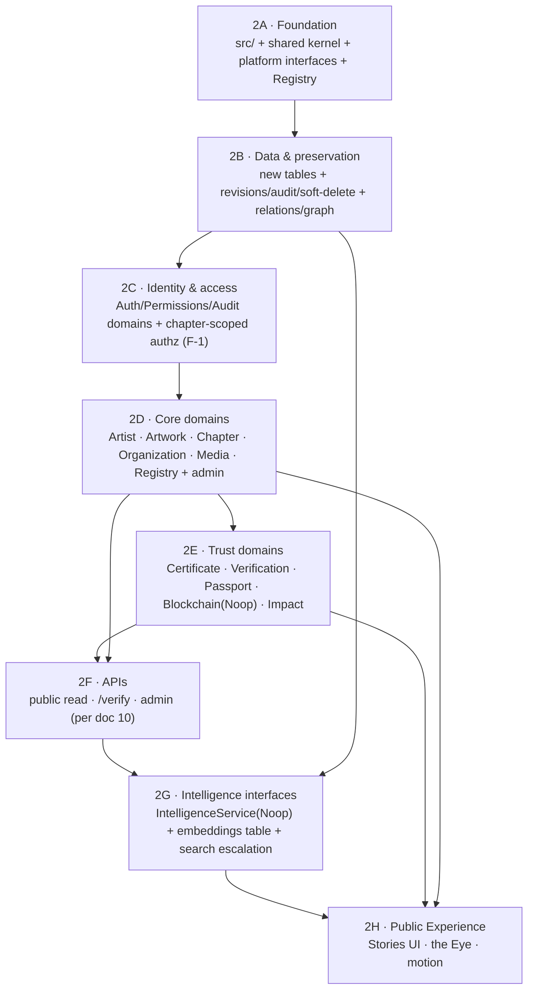

# 15 · Implementation Roadmap (foundation-outward)

**Purpose.** Turn the Phase 2 design package into an **ordered, dependency-aware build plan** that grows the institution *foundation outward* — domain architecture, database, identity, core domains, trust domains, APIs, intelligence interfaces — **before** the public experience is expanded. This roadmap is the sequencing contract: it says what gets built, in what order, what "done" means for each step, and how the running app stays green the entire way. Its governing law: **build infrastructure before features** — *architecture before animation; meaning before motion; story before effects* ([00-README](00-README.md)).

**Extends.** [docs/16 · Development Roadmap](../16-development-roadmap.md) (the Phase 1 phase-by-phase plan). Phase 1's "Phase 2 — The Experience" assumed the next move was cinematic/visual. The Architectural Evolution ratified in [00-README §Architectural evolution](00-README.md) **reorders that**: the visual experience is now the *last* Phase 2 track (2H), not the next one. Everything before 2H is the institutional infrastructure that the experience will stand on. This roadmap also operationalizes [ADR-0009](adr/0009-domain-driven-architecture.md) (DDD), [ADR-0004](adr/0004-repository-pattern.md) (Repository Pattern), [ADR-0010](adr/0010-intelligence-layer.md) (Intelligence Layer), and [ADR-0011](adr/0011-knowledge-graph-core.md) (knowledge graph as core).

---

## 0. The governing rule — build infrastructure before features

> **Do not add visual features next.** We build the foundation and work outward. Each ring depends on the one inside it; we do not start a ring until the ring inside it meets its exit criteria.

```
        ┌───────────────────────────────────────────────────────┐
        │  2H · Public Experience (Stories UI, the Eye, motion)  │  ← LAST
        │  ┌─────────────────────────────────────────────────┐  │
        │  │  2G · Intelligence interfaces (Noop) + embeddings │  │
        │  │  ┌───────────────────────────────────────────┐    │  │
        │  │  │  2F · APIs (public read · /verify · admin)  │    │  │
        │  │  │  ┌─────────────────────────────────────┐    │    │  │
        │  │  │  │  2E · Trust domains (Cert · Verify ·  │    │    │  │
        │  │  │  │       Passport · Blockchain · Impact) │    │    │  │
        │  │  │  │  ┌───────────────────────────────┐    │    │    │  │
        │  │  │  │  │  2D · Core domains + admin     │    │    │    │  │
        │  │  │  │  │  ┌─────────────────────────┐  │    │    │    │  │
        │  │  │  │  │  │ 2C · Identity & access  │  │    │    │    │  │
        │  │  │  │  │  │ ┌─────────────────────┐ │  │    │    │    │  │
        │  │  │  │  │  │ │ 2B · Data & graph   │ │  │    │    │    │  │
        │  │  │  │  │  │ │ ┌─────────────────┐ │ │  │    │    │    │  │
        │  │  │  │  │  │ │ │ 2A · Foundation │ │ │  │    │    │    │  │
        │  │  │  │  │  │ │ │  (src/ + kernel │ │ │  │    │    │    │  │
        │  │  │  │  │  │ │ │  + platform     │ │ │  │    │    │    │  │
        │  │  │  │  │  │ │ │  abstractions   │ │ │  │    │    │    │  │
        │  │  │  │  │  │ │ │  + Registry)    │ │ │  │    │    │    │  │
        │  │  │  │  │  │ │ └─────────────────┘ │ │  │    │    │    │  │
        │  │  │  │  │  │ └─────────────────────┘ │  │    │    │    │  │
        │  │  │  │  │  └─────────────────────────┘  │    │    │    │  │
        │  │  │  │  └───────────────────────────────┘    │    │    │  │
        │  │  │  └─────────────────────────────────────┘    │    │  │
        │  │  └───────────────────────────────────────────┘    │  │
        │  └─────────────────────────────────────────────────┘  │
        └───────────────────────────────────────────────────────┘
                          foundation  →  outward
```

---

## 1. Phase dependency graph



**Reading the graph.** The spine is strictly linear `2A → 2B → 2C → 2D → 2E → 2F`. Two abstractions (Graph in 2B, IntelligenceService in 2G) are designed early but stay implemented as Noop/local until much later — the dependency arrows show *interface availability*, not feature completion. **2H consumes everything**; it cannot start until 2D/2E/2F are green.

---

## 2. The phases

Each phase lists: **Goal**, **Deliverables**, **Domains/abstractions it lands**, **Exit criteria**, and a **Definition of Done** checklist. Every phase obeys the cross-cutting engineering principles in [00-README §Cross-cutting](00-README.md) (strict TS, zod at boundaries, soft-delete, audit, no driver leaks, no duplicated logic).

---

### Phase 2A — Foundation  ·  **IN PROGRESS** 🟡

> *This phase is being implemented now.* It installs the skeleton everything else hangs on, with zero change to what a visitor sees.

**Goal.** Stand up the `src/` domain-driven structure, the shared kernel, the platform abstractions (as interfaces with Noop/local implementations), and the **Registry domain as the reference domain** — all behind back-compat shims so `app/` and `lib/` keep working unchanged.

**Deliverables.**
- `src/` tree + path aliases wired in `tsconfig.json`:
  - `src/domains/*` — the 12 domains ([ADR-0009](adr/0009-domain-driven-architecture.md)); only `registry` is fleshed out this phase.
  - `src/shared/*` — the **shared kernel** (alias `@shared`).
  - `src/platform/*` — **infrastructure** (alias `@platform`): `db`, `storage`, `blockchain`, `intelligence` (alias `@intelligence`).
  - Aliases: `@domains/*`, `@shared/*`, `@platform/*`, `@intelligence/*`.
- **Shared kernel** (`src/shared/`):
  - `Result<T, E>` (typed success/failure; no throwing across domain boundaries).
  - error taxonomy (`NotFoundError`, `ValidationError`, `ConflictError`, `ForbiddenError`, …).
  - pagination primitives (cursor + offset page/result types, matching doc 10's conventions).
  - ID helpers (Registry ID format `PB-<KIND>-<NNNNNN>`, validators, branded types).
  - **base `Repository`** abstraction ([ADR-0004](adr/0004-repository-pattern.md)) — the interface every domain repo extends; **no driver imports leak out of `src/platform/db`**.
  - **preservation primitives** — shared helpers for `governance()` semantics: soft-delete (`archived_at`), audit-log write, revision snapshot, restore. Every domain service composes these; nobody re-implements them ("no duplicated logic").
- **Platform abstractions** (interfaces first, Noop/local impls now):
  - `db` repository wiring (Drizzle/SQLite impl behind the base `Repository`).
  - `StorageService` — interface + **local-filesystem** impl now (Supabase Storage later).
  - `BlockchainService` — interface + **Noop** impl now ([ADR-0007](adr/0007-blockchain-abstraction.md), [07](07-blockchain-abstraction-interface.md)).
  - `IntelligenceService` — interface + **Noop** impl now ([ADR-0010](adr/0010-intelligence-layer.md), [14](14-intelligence-layer.md)).
- **Registry domain** (`src/domains/registry/`) — the reference implementation: entity, repository interface + Drizzle impl, service (atomic minting via `registry_counters`, kind-agnostic), zod schemas, view-models. Pattern that 2D/2E copy.
- **Back-compat shim** — `lib/registry.ts` re-exports the new Registry domain service so existing callers (`app/admin/*`, seeds) keep working unchanged. No call site is forced to migrate this phase.

**Domains/abstractions landed.** `Registry` (reference) · shared kernel · base `Repository` · `StorageService` (local) · `BlockchainService` (Noop) · `IntelligenceService` (Noop).

**Exit criteria.** `src/` + aliases compile under strict TS; Registry domain mints IDs through the service; `lib/registry.ts` shim delegates to it with identical behavior; existing build, seed, admin, and Genesis Chapter all still pass; no driver import exists outside `src/platform/db`.

**Definition of Done.**
- [ ] `tsconfig.json` aliases `@domains @shared @platform @intelligence` resolve; `tsc --noEmit` clean.
- [ ] Shared kernel: `Result`, errors, pagination, IDs, base `Repository`, preservation primitives — each unit-tested.
- [ ] Four platform abstractions exist as interfaces; `StorageService`=local, `BlockchainService`/`IntelligenceService`=Noop.
- [ ] Registry domain full vertical slice; integration test mints a sequential, gap-free `PB-<KIND>-<NNNNNN>`.
- [ ] `lib/registry.ts` is a thin shim over the domain service; all existing call sites unchanged and green.
- [ ] Lint/review rule bans Drizzle/SQLite/Supabase imports outside `src/platform/db`.
- [ ] Genesis Chapter renders identically (no visual change shipped).

---

### Phase 2B — Data & preservation

**Goal.** Land every new Phase 2 table as additive, Postgres-ready SQLite migrations; wire revisions/audit/soft-delete through the domain services (not ad hoc); and stand up the **relations vocabulary + Graph capability** ([03](03-knowledge-graph.md), [ADR-0011](adr/0011-knowledge-graph-core.md)).

**Deliverables.**
- New tables (additive migrations, 1:1 Postgres-ready, mirrored in SQLite) — exact names from [00-README §New Phase 2 records](00-README.md):
  `passports` · `passport_claims` · `stories` · `contributions` · `claim_requests` · `chain_anchors` · `onchain_refs` · `verification_events` · `translations` · `relations`.
- **Media extensions** — extend `media` with `usage_rights`, `rights_holder`, `derivative_of`, `variant` (the DAM/`assets` *lens*, not a fork — reconciliation #5).
- **`entity_links.archived_at`** added (additive migration) so edges soft-delete (reconciliation #3, graph open question A).
- **`registry_counters.kind`** comment updated to include `id`, `asset`, `anchor`, `story` (reconciliation #1; minting already kind-agnostic).
- **Preservation wired through services** — every domain write goes through the 2A preservation primitives: soft-delete via `archived_at`, an `audit_logs` row, and a `revisions` snapshot, transactionally. Restore path exists. **Nothing is hard-deleted.**
- **Relations vocabulary** — seed the `relations` controlled allow-list (verbs in [03 §2](03-knowledge-graph.md)), retaining all architecture/07 starter verbs as `active`.
- **Graph capability** (`src/shared/graph` or a Graph kernel module): the shared `graph.*` surface (`neighbors`, `path`, `related`) over `entity_links`, with the §5 validation invariants (live relation, signature match, both endpoints exist, UPSERT identity, symmetric normalization, audit on every write), bounded recursive CTEs, and the **transactional mirror-edge** rule (FK ⇆ mirror edge written together).

**Domains/abstractions landed.** Data layer for all 12 domains · Graph capability (shared, core per [ADR-0011](adr/0011-knowledge-graph-core.md)) · preservation pipeline.

**Exit criteria.** All new tables migrate cleanly up/down on SQLite and lint as Postgres-ready; the `relations` allow-list rejects unknown verbs; the Graph capability creates/retracts edges transactionally with records and never hard-deletes; the FK↔mirror-edge reconciliation test passes.

**Definition of Done.**
- [ ] 10 new tables + media extensions + `entity_links.archived_at` shipped as additive migrations (up/down tested).
- [ ] `registry_counters.kind` comment includes `id`, `asset`, `anchor`, `story`.
- [ ] Soft-delete + audit + revision + restore proven by integration tests on the Registry reference domain.
- [ ] `relations` seeded; service rejects (a) unknown relation, (b) signature mismatch, (c) missing endpoint.
- [ ] `graph.neighbors/path/related` return correct bounded results; recursive depth + visited-set + LIMIT enforced.
- [ ] Mirror-edge reconciliation: every FK has its edge, every mirror edge has its FK.
- [ ] App still green; no schema change is destructive.

---

### Phase 2C — Identity & access foundation

**Goal.** Move Auth, Permissions, and Audit into the domain structure and **close security finding F-1**: per-record, chapter-scoped authorization.

**Deliverables.**
- Auth / Permissions / Audit relocated into domains (or a clearly-owned access module) behind back-compat shims so `lib/auth.ts` / `lib/rbac` callers keep working.
- **Chapter-scoped authorization** — `requirePermission(perm, { chapterId })` that grants if the actor holds the permission *globally or for that row's chapter* via `user_roles.chapter_id` ([11 · F-1](11-security-review.md), [architecture/06](../architecture/06-permission-matrix.md)). Designed **RLS-ready** so the Postgres migration inherits it as a row predicate.
- Audit domain: append-only `audit_logs` writes standardized through the 2A primitive; every privileged action audited.

**Domains/abstractions landed.** Auth · Permissions · Audit (access foundation) — consumed by every later domain.

**Exit criteria.** A Lagos editor with `artwork.update` **cannot** edit an Abuja artwork at the app layer; global-scope roles still work; all checks audited; the design maps onto an RLS predicate without rework.

**Definition of Done.**
- [ ] `requirePermission(perm, {chapterId})` enforced; IDOR test (cross-chapter edit) fails closed.
- [ ] Global vs chapter-scoped grants both covered by tests.
- [ ] Auth/Permissions/Audit reachable via shims; existing admin login + RBAC unchanged.
- [ ] F-1 marked resolved in [11 · Security Review](11-security-review.md) tracking.

---

### Phase 2D — Core domains

**Goal.** Full CRUD through domain services + an admin foundation for the content backbone: **Artist, Artwork, Chapter, Organization, Media** (DAM ingest pipeline), and **Registry** (already reference) — every write producing edges, audit, and revisions.

**Deliverables.**
- Vertical slices for `Artist · Artwork · Chapter · Organization · Media` following the Registry reference pattern: entity, repository interface + Drizzle impl, service, zod schemas, view-models.
- **Media / DAM ingest pipeline** ([09](09-media-management-strategy.md)) on `StorageService`: upload → checksum/fixity → metadata extraction stub → variants → `media` (+ rights extensions). No AI extraction yet (that is 2G/Intelligence).
- **Admin foundation** — generic, reusable admin scaffolding (list/detail/edit, soft-delete/restore, review workflow `draft → in_review → published → archived`) wired to domain services, replacing per-page bespoke actions incrementally via shims ([08](08-admin-wireframes.md)).
- Each create/update transactionally writes its **mirror edges** (`created_by`, `exhibited_in`, etc.) via the 2B Graph capability.

**Domains/abstractions landed.** `Artist · Artwork · Chapter · Organization · Media · Registry` (full CRUD) · admin foundation · DAM pipeline.

**Exit criteria.** Each core domain is fully CRUD-able through its service (no Drizzle in callers); creating an artwork mints its ID, writes its edges, audits, and snapshots in one transaction; DAM ingest stores a file with a checksum and a `media` row; admin foundation drives at least one domain end-to-end.

**Definition of Done.**
- [ ] Five core domains pass CRUD integration tests through services only.
- [ ] DAM ingest: upload → checksum → `media` row → retrievable via `StorageService` (local).
- [ ] Admin foundation supports list/edit/soft-delete/restore + status workflow for ≥1 domain; others migrate via shims.
- [ ] Every core write produces mirror edges + audit + revision atomically.
- [ ] Existing public pages re-sourced from domain services with no visible change.

---

### Phase 2E — Trust domains

**Goal.** Build the Trust Layer domains on the now-solid core: **Certificate, Verification** (`/verify` + claim/OCR interfaces), **Passport**, **Blockchain** abstraction wiring (Noop), and **Impact**.

**Deliverables.**
- **Certificate** domain — issue/revoke/reserve (`status: draft | issued | revoked | reserved`; revocation is a status, never a delete), public permalink `/certificates/{publicId}`, certificate ⇄ person/org edges (`awarded`/`issued_to`).
- **Verification** domain — the `/verify` contract (off-chain hash verify) and the **claim/OCR interfaces** for `claim_requests` (`uploaded | ocr_done | matched | needs_review | claimed | rejected`); OCR itself is an `IntelligenceService` capability, **stubbed/Noop** now ([05](05-certificate-verification-spec.md), [ADR-0008](adr/0008-certificate-claiming.md)). `verification_events` append-only log written here.
- **Passport** domain — the **projection** over a person's sub-graph ([04](04-planet-passport-spec.md), [ADR-0002](adr/0002-passport-as-projection.md)): `passports` (`passport_status: unclaimed | claimed | linked`), `passport_claims` workflow (`pending | approved | rejected`), `contributions` aggregation. A Passport is **not** a user account; aggregation is computed from graph + certificates, not duplicated.
- **Blockchain** domain — wiring on the `BlockchainService` **Noop** impl; `chain_anchors` + `onchain_refs` (the source of truth; `certificates.soulbound_ref` becomes a kept-in-sync pointer — reconciliation #8). No real chain calls yet ([06](06-solana-integration-plan.md), [07](07-blockchain-abstraction-interface.md)).
- **Impact** domain — `impact_metrics` + `measures` edges to chapters.

**Domains/abstractions landed.** `Certificate · Verification · Passport · Blockchain (Noop) · Impact`.

**Exit criteria.** A certificate can be issued/revoked through the service and resolves at `/verify`; a `claim_request` walks its state machine to `needs_review` with OCR stubbed; a claimed Passport projects a person's full sub-graph from the graph (not duplicated storage); all anchor/mint paths run against Noop and log `verification_events`.

**Definition of Done.**
- [ ] Certificate issue/revoke/reserve + `/verify` off-chain hash check pass tests.
- [ ] `claim_requests` state machine + `passport_claims` approval flow tested; OCR behind `IntelligenceService` Noop.
- [ ] Passport projection assembles artworks + certs + contributions via the graph; withheld-consent person yields no public Passport.
- [ ] Blockchain paths run on Noop; `onchain_refs` is source of truth, `soulbound_ref` synced; `verification_events` written.
- [ ] Impact metrics linked to chapters via `measures` edges.

---

### Phase 2F — APIs

**Goal.** Expose the domain layer through the API surface in [10 · API Design](10-api-design.md): the **public read API**, the **`/verify` API**, and the **admin API** — every handler sitting on the domain/repository layer, never the driver.

**Deliverables.**
- **Public Read API** `/api/v1/public/*` (published-only), zod-validated boundaries, cursor pagination, `X-PlanetB-API-Version`.
- **Verify API** `/api/v1/verify/*` (no auth — the trust surface).
- **Admin API** — server actions for mutations + `/api/v1/admin/*` route handlers for machine clients (session + RBAC + chapter scoping from 2C; audited).
- **OpenAPI 3.1** generated from the same zod schemas (`/api/v1/openapi.json` + Swagger UI) + a typed client (no hand-written fetchers).
- `me` endpoints: `POST /api/v1/me/passport-claims`, `POST /api/v1/me/claim-requests`, `GET /api/v1/me/passport`.

**Domains/abstractions landed.** Public/Verify/Admin API contracts over all domains.

**Exit criteria.** Public API returns published-only domain view-models with pagination; `/verify/{publicId}` resolves; admin API enforces RBAC + chapter scoping and audits; OpenAPI validates and the typed client compiles.

**Definition of Done.**
- [ ] Public read endpoints (published-only) + pagination + versioning header, contract-tested.
- [ ] `/verify` contract matches doc 10; resolves issued certificates, rejects unknown/revoked correctly.
- [ ] Admin API enforces F-1 chapter scoping; every mutation audited.
- [ ] `/api/v1/openapi.json` validates as OpenAPI 3.1; typed client generated and compiling.
- [ ] No handler imports a DB driver (lint rule green).

---

### Phase 2G — Intelligence interfaces wired (still Noop)

**Goal.** Wire the `IntelligenceService` interfaces into the relevant domains, add the **embeddings table**, and define the **search escalation path** — all without shipping any AI ([14](14-intelligence-layer.md), [ADR-0010](adr/0010-intelligence-layer.md)).

**Deliverables.**
- `IntelligenceService` capability methods (semantic search, embeddings, OCR, metadata extraction, translation, recommendations) wired where domains call them — all backed by the **Noop** impl. The Intelligence Layer sits **beside** the app, never inside it.
- **`embeddings` table** (Postgres-ready; pgvector-shaped column designed, SQLite-mirrored), additive migration.
- **Search escalation path** documented + scaffolded: keyword/FTS now → Postgres FTS at migration → semantic search when Intelligence is implemented. Verification OCR (2E) and DAM metadata extraction (2D) point at these interfaces.

**Domains/abstractions landed.** `IntelligenceService` (wired, Noop) · `embeddings` table · search escalation contract.

**Exit criteria.** Domains call Intelligence through the interface only; swapping Noop for a real provider requires no domain changes; the `embeddings` table migrates; the search escalation path is documented with no AI shipped.

**Definition of Done.**
- [ ] Intelligence capabilities reachable via interface; Noop returns deterministic empty/echo results.
- [ ] `embeddings` table migrates (up/down); schema is pgvector-ready.
- [ ] Search escalation path documented; current keyword/FTS search routes through the seam.
- [ ] No AI dependency or model call ships; replacing Noop touches only `src/platform/intelligence`.

---

### Phase 2H — Public Experience (THEN resume)

**Goal.** *Now* resume and expand the public experience on top of the finished institution: the **Stories UI**, the Eye as navigation + seal, the cinematic threshold, motion system — the work [docs/16](../16-development-roadmap.md) originally slated as "Phase 2 — The Experience."

**Deliverables.**
- Stories as the primary way to experience the archive ([ADR-0003](adr/0003-story-first-class.md)) — sourced from the Story domain + Graph "read next."
- The Eye / cinematic threshold / emotional scroll with static + reduced-motion fallbacks; motion system at 60fps.
- Documentary Library + Video Archive, Performance & Panel pages.

**Domains/abstractions landed.** Experience layer over Story, Chapter, Media, Graph, Passport.

**Exit criteria.** Stories render from the domain layer + graph; museum-grade a11y (WCAG AA) and reduced-motion paths; performance budgets met on a mid-range Abuja phone; *"I've never experienced anything like this."*

**Definition of Done.**
- [ ] Stories UI consumes Story domain + `graph.related` for "read next."
- [ ] The Eye + threshold + scroll scenes with static fallbacks; 60fps; reduced-motion honored.
- [ ] WCAG AA verified; performance budgets met on mid-range mobile.
- [ ] All experience data flows through domain services/APIs — no direct DB access from UI.

---

## 3. How the running app stays green throughout (no big-bang)

The Phase 1 app must never break. Three mechanisms guarantee it:

1. **Back-compat shims.** Each migrated piece (`lib/registry.ts`, `lib/auth.ts`, admin actions) is replaced by a thin re-export that delegates to the new domain service. Call sites are unchanged until they are migrated deliberately, file-by-file ([ADR-0009](adr/0009-domain-driven-architecture.md), [ADR-0004](adr/0004-repository-pattern.md)). No "rewrite the world" step exists.
2. **Additive-only migrations.** Every schema change in 2B/2G is additive (new tables, new nullable columns, `archived_at`). Nothing is dropped or renamed; nothing is hard-deleted; up/down tested both dialects.
3. **Coexisting layouts.** `app/` + `lib/` and `src/domains/*` live side-by-side during migration. `app/` keeps routing/composition; business logic moves into domains incrementally. CI runs the full suite + a Genesis Chapter render check every phase.

```
app/ + lib/  ──shim──▶  src/domains/* (services)  ──interface──▶  src/platform/* (db/storage/blockchain/intelligence)
   (Phase 1, still live)        (grows 2A→2E)                   (Noop/local now, real later)
```

---

## 4. Risks & mitigations

| # | Risk | Mitigation |
|---|------|-----------|
| R-1 | **Foundation fatigue** — pressure to ship visuals (2H) before infrastructure. | This roadmap is the contract: 2H is last. The README's governing rule is the answer to "can we just do the Eye now?" — **no**. |
| R-2 | **Two layouts coexisting** confuse contributors about where code belongs. | [ADR-0009](adr/0009-domain-driven-architecture.md) module convention + lint rule banning driver imports outside `src/platform/db`; shims clearly marked deprecated. |
| R-3 | **Leaky repository** (returns ORM rows) silently defeats [ADR-0004](adr/0004-repository-pattern.md). | Lint/review rule + view-models only; integration tests assert no driver type escapes a domain. |
| R-4 | **Graph drift** — mirror edges diverge from FKs. | Transactional mirror writes (2B §5.1) + a reconciliation job/test every CI run. |
| R-5 | **SQLite↔Postgres dialect drift.** | Additive-only, Postgres-ready authoring; CI validates both; no SQLite-only patterns ([ADR-0001](adr/0001-data-backbone.md)). |
| R-6 | **Premature AI/chain coupling.** | `IntelligenceService`/`BlockchainService` stay Noop until explicitly approved; replacing them touches only `src/platform/*`. |
| R-7 | **Authorization regressions** during the Auth move (2C). | F-1 IDOR tests fail-closed; shims preserve existing behavior; RLS-ready design reviewed against doc 11. |
| R-8 | **Scope creep inside a phase** delays the spine. | Per-phase Definition of Done is the gate; a ring does not start until the inner ring's DoD is met. |

---

## Open questions for approval

1. **Phase granularity for delivery.** Should 2D (five core domains) ship as one milestone or split per-domain (Artist → Artwork → Chapter → Organization → Media) for earlier feedback?
2. **Admin foundation vs. per-page.** Confirm the generic admin scaffolding in 2D (versus continuing bespoke per-page actions migrated one at a time) — affects how fast 2D completes.
3. **Embeddings table timing.** Land `embeddings` in 2G (as written) or earlier in 2B alongside the other tables so all schema migrations happen once? (Trade-off: one migration pass vs. keeping AI-shaped schema out of the data phase.)
4. **`entity_links.archived_at` + edge soft-delete** — confirm this additive migration in 2B (graph open question A, reconciliation #3).
5. **Mirror-edge auto-write policy** — confirm FK-backed relations are auto-mirrored transactionally by repositories in 2B (graph open question 2), versus computed on read.
6. **F-1 as a 2C gate.** Confirm chapter-scoped authorization is a hard exit criterion of 2C (blocking 2D), given it is the single most important authorization hardening (doc 11).
7. **2H trigger.** What concrete signal authorizes starting 2H — all of 2D/2E/2F green, or a founder go/no-go review after 2F?
8. **Phase 1 doc 16 reconciliation.** Confirm that this roadmap **supersedes** the ordering of "Phase 2 — The Experience" in [docs/16](../16-development-roadmap.md) (experience moves from next → last), and that doc 16 should carry a note pointing here.
